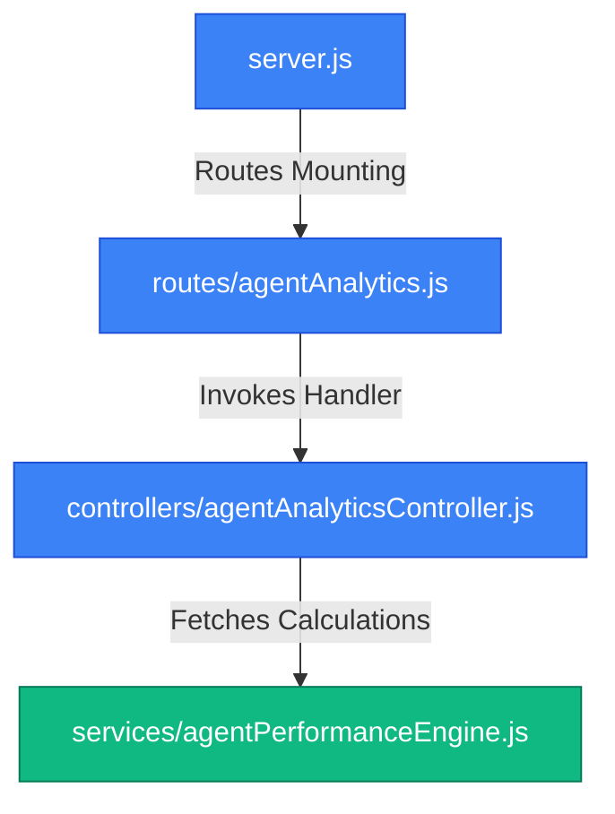

# File-Level Architecture: Agent Analytics Integration

This document traces the file-level architecture changes introduced for the Agent Analytics Backend.

---

## Mapped Modules & Files

### 1. Agent Analytics Service (Performance Engine)
- **Path**: [agentPerformanceEngine.js](file:///d:/mern/distributer/backend/services/agentPerformanceEngine.js) [NEW]
- **Role**: Computes metrics from raw database data.
- **Exports**:
  - `fetchAgentRecords(agentId)` (Utility)
  - `calculateCompletionMetrics(agentId)`
  - `calculateSLAMetrics(agentId)`
  - `calculateResolutionMetrics(agentId)`
  - `calculateProductivityScore(agentId)`

### 2. Agent Analytics API Routing
- **Path**: [agentAnalytics.js](file:///d:/mern/distributer/backend/routes/agentAnalytics.js) [MODIFY]
- **Role**: Directs requests to `/analytics` towards the controller. Implements standard `protect` and `restrictTo('agent')` guards.
- **Root Mounting Path**: mounted at `/api/agent-workspace` in [server.js](file:///d:/mern/distributer/backend/server.js).

### 3. Analytics Request Handler
- **Path**: [agentAnalyticsController.js](file:///d:/mern/distributer/backend/controllers/agentAnalyticsController.js) [MODIFY]
- **Role**: Coordinates calculation requests and responds with JSON structured metrics.
- **Calculations Flow**:
  1. Checks for a cache hit in local memory.
  2. If cache missed, runs engine calls concurrently via `Promise.all()`.
  3. Caches response payload for 5 minutes (300,000ms).
  4. Returns the result with the properties `productivity`, `completionMetrics`, `slaMetrics`, and `resolutionMetrics`.
