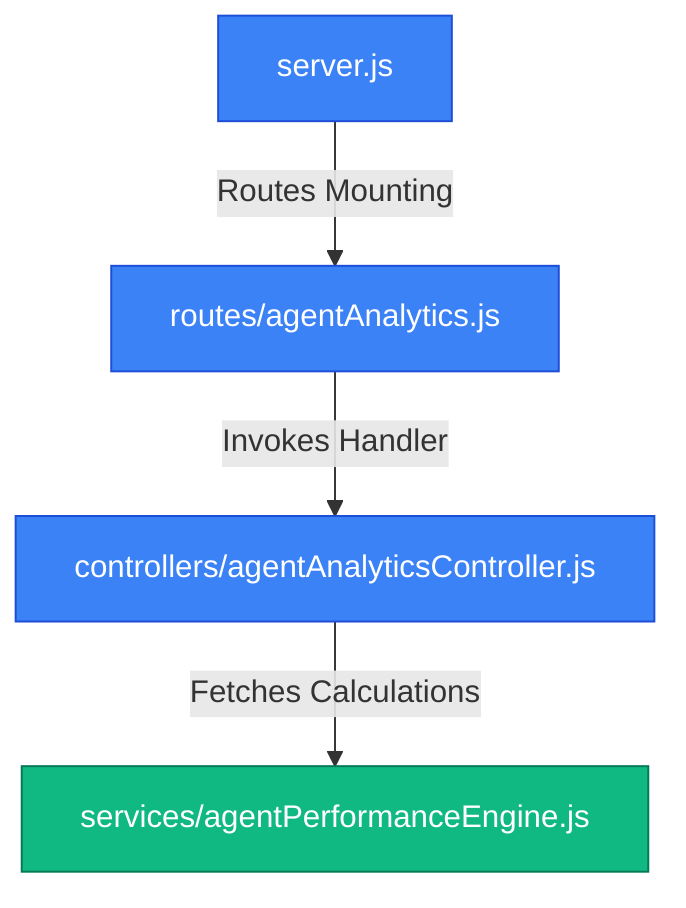
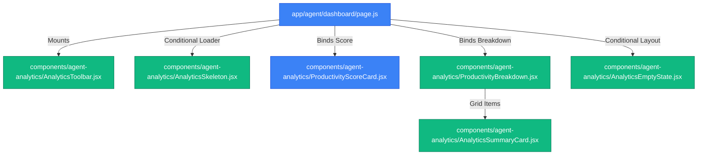
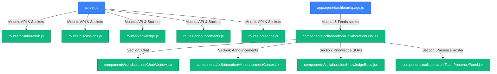

# File-Level Architecture: Agent Analytics Integration

This document traces the file-level architecture changes introduced for the Agent Analytics Backend.

---

## Mapped Modules & Files

### 1. Agent Analytics Service (Performance Engine)
- **Path**: [agentPerformanceEngine.js](file:///d:/mern/distributer/backend/services/agentPerformanceEngine.js) [NEW]
- **Role**: Computes metrics from raw database data.
- **Exports**:
  - `fetchAgentRecords(agentId)` (Utility)
  - `calculateCompletionMetrics(agentId)`
  - `calculateSLAMetrics(agentId)`
  - `calculateResolutionMetrics(agentId)`
  - `calculateProductivityScore(agentId)`

### 2. Agent Analytics API Routing
- **Path**: [agentAnalytics.js](file:///d:/mern/distributer/backend/routes/agentAnalytics.js) [MODIFY]
- **Role**: Directs requests to `/analytics` towards the controller. Implements standard `protect` and `restrictTo('agent')` guards.
- **Root Mounting Path**: mounted at `/api/agent-workspace` in [server.js](file:///d:/mern/distributer/backend/server.js).

### 3. Analytics Request Handler
- **Path**: [agentAnalyticsController.js](file:///d:/mern/distributer/backend/controllers/agentAnalyticsController.js) [MODIFY]
- **Role**: Coordinates calculation requests and responds with JSON structured metrics.
- **Calculations Flow**:
  1. Checks for a cache hit in local memory.
  2. If cache missed, runs engine calls concurrently via `Promise.all()`.
  3. Caches response payload for 5 minutes (300,000ms).
  4. Returns the result with the properties `productivity`, `completionMetrics`, `slaMetrics`, and `resolutionMetrics`.

---

## Mapped Frontend Modules & Files

### 1. Reusable Loader Skeleton
- **Path**: [AnalyticsSkeleton.jsx](file:///d:/mern/distributer/client/src/components/agent-analytics/AnalyticsSkeleton.jsx) [NEW]
- **Role**: Renders pulsing layout blocks for scores and summary cards during loading phases.

### 2. Summary Indicator Widget
- **Path**: [AnalyticsSummaryCard.jsx](file:///d:/mern/distributer/client/src/components/agent-analytics/AnalyticsSummaryCard.jsx) [NEW]
- **Role**: Formats individual metrics (title, value, subtitle, icon) with trend indicator badges.

### 3. Productivity Rating Score Card
- **Path**: [ProductivityScoreCard.jsx](file:///d:/mern/distributer/client/src/components/agent-analytics/ProductivityScoreCard.jsx) [MODIFY]
- **Role**: Displays score percentage, alphabetical grade badge with responsive coloring, and progress bar trackers.

### 4. Grid Breakdown Layout
- **Path**: [ProductivityBreakdown.jsx](file:///d:/mern/distributer/client/src/components/agent-analytics/ProductivityBreakdown.jsx) [NEW]
- **Role**: Groups four instances of the summary cards inside a responsive 2x2 grid representing Completion Rate, SLA Compliance, Speed, and Counts.

### 5. Control Toolbar & Empty Redirection
- **Path**: [AnalyticsToolbar.jsx](file:///d:/mern/distributer/client/src/components/agent-analytics/AnalyticsToolbar.jsx) [NEW]
  - **Role**: Action header showing refresh trigger buttons and time logs.
- **Path**: [AnalyticsEmptyState.jsx](file:///d:/mern/distributer/client/src/components/agent-analytics/AnalyticsEmptyState.jsx) [NEW]
  - **Role**: Standard view rendered when agent has no data, offering a CTA link redirecting back to the Workspace tasks tab.

### 6. Workspace Rankings Panel
- **Path**: [RankingCard.jsx](file:///d:/mern/distributer/client/src/components/agent-analytics/RankingCard.jsx) [NEW]
  - **Role**: Display Global, Department, and Team Rank along with highlight leadership badges.

### 7. Performance Overlay Trend Chart
- **Path**: [PerformanceTrendChart.jsx](file:///d:/mern/distributer/client/src/components/agent-analytics/PerformanceTrendChart.jsx) [NEW/MODIFY]
  - **Role**: Custom SVG chart drawing comparative current vs previous lines for Weekly (14 days) and Monthly (8 weeks) periods. Supports PNG/SVG client-side downloads.

### 8. Delta Insights & Achievements Cards
- **Path**: [ImprovementInsights.jsx](file:///d:/mern/distributer/client/src/components/agent-analytics/ImprovementInsights.jsx) [NEW]
  - **Role**: Displays 30-day performance trends and rank movement deltas.
- **Path**: [PersonalBestCard.jsx](file:///d:/mern/distributer/client/src/components/agent-analytics/PersonalBestCard.jsx) [NEW]
  - **Role**: Showcases all-time records (highest score, peak task count, longest streak, fastest speed).

### 9. Trend Switcher Selector
- **Path**: [TrendSwitcher.jsx](file:///d:/mern/distributer/client/src/components/agent-analytics/TrendSwitcher.jsx) [NEW]
  - **Role**: Button toggle controlling the chart's Weekly/Monthly active state.

### 10. Snapshot Caching Schema
- **Path**: [AgentPerformanceSnapshot.js](file:///d:/mern/distributer/backend/models/AgentPerformanceSnapshot.js) [NEW]
  - **Role**: Persistent document schema enabling fast DB-level caching of historical performance.

### 11. AI Coaching & Recommendation Tracking Models
- **Path**: [AgentCoachingSnapshot.js](file:///d:/mern/distributer/backend/models/AgentCoachingSnapshot.js) [NEW]
  - **Role**: Stores generated AI/fallback coaching metrics, strengths, weaknesses, structured goals, focus area, and motivation message.
- **Path**: [CoachingAction.js](file:///d:/mern/distributer/backend/models/CoachingAction.js) [NEW]
  - **Role**: Tracks status (completed, saved, dismissed) of user interactions with coaching recommendations.

### 12. Coaching Routers and Controllers
- **Path**: [agentAI.js](file:///d:/mern/distributer/backend/routes/agentAI.js) [NEW]
  - **Role**: Defines endpoints for requesting coaching updates, history timeline, and recommendation updates.
- **Path**: [agentAICoachingController.js](file:///d:/mern/distributer/backend/controllers/agentAICoachingController.js) [NEW]
  - **Role**: Handles 15-minute refresh cooldown validations, merges recommendation progress statuses, and retrieves snapshots.
- **Path**: [agentCoachingEngine.js](file:///d:/mern/distributer/backend/services/agentCoachingEngine.js) [NEW]
  - **Role**: Combines metrics, generates LLM Groq payloads or runs rule-based engine fallbacks, and creates cache snapshots in the database.

### 13. Coaching UI Panels & Timeline
- **Path**: [CoachingSummaryCard.jsx](file:///d:/mern/distributer/client/src/components/agent-ai/CoachingSummaryCard.jsx) [NEW]
  - **Role**: Shows performance overview text, confidence indicators, motivation quotes, and rank/score improvement success animations.
- **Path**: [CoachingImpactCard.jsx](file:///d:/mern/distributer/client/src/components/agent-ai/CoachingImpactCard.jsx) [NEW]
  - **Role**: Measures coaching efficiency by tracking goals achieved, followed recommendations, and delta score deltas.
- **Path**: [RecommendationsPanel.jsx](file:///d:/mern/distributer/client/src/components/agent-ai/RecommendationsPanel.jsx) [NEW]
  - **Role**: Lists recommendations and lets agents trigger status updates (Complete, Save, Dismiss).
- **Path**: [GoalPlanner.jsx](file:///d:/mern/distributer/client/src/components/agent-ai/GoalPlanner.jsx) [NEW]
  - **Role**: Displays targeted upcoming goals with difficulty rating badges and estimated productivity index gains.
- **Path**: [CoachingTimeline.jsx](file:///d:/mern/distributer/client/src/components/agent-ai/CoachingTimeline.jsx) [NEW]
  - **Role**: Visualizes historical coaching scores and summaries over time.

### 14. Achievements & Gamification Modules
- **Path**: [Achievement.js](file:///d:/mern/distributer/backend/models/Achievement.js) [NEW]
  - **Role**: Mongoose schema for master achievements definitions.
- **Path**: [AgentAchievement.js](file:///d:/mern/distributer/backend/models/AgentAchievement.js) [NEW]
  - **Role**: tracks progress and unlocks for each agent-achievement mapping.
- **Path**: [achievementEngine.js](file:///d:/mern/distributer/backend/services/achievementEngine.js) [NEW]
  - **Role**: Calculates streaks, checks achievements thresholds, evaluates points/XP/level up, and triggers activity logging.
- **Path**: [gamificationController.js](file:///d:/mern/distributer/backend/controllers/gamificationController.js) [NEW]
  - **Role**: Exposes endpoints for profile state, achievements list, and milestones reward timeline.
- **Path**: [gamification.js](file:///d:/mern/distributer/backend/routes/gamification.js) [NEW]
  - **Role**: Handles router endpoints `/profile`, `/achievements`, and `/rewards`.

### 15. Achievements & Progression UI Components
- **Path**: [AgentLevelCard.jsx](file:///d:/mern/distributer/client/src/components/agent-achievements/AgentLevelCard.jsx) [NEW]
  - **Role**: Renders xp progress slider, level indicator, and points balance in a themed gradient card.
- **Path**: [StreakTracker.jsx](file:///d:/mern/distributer/client/src/components/agent-achievements/StreakTracker.jsx) [NEW]
  - **Role**: Renders current and longest streaks alongside a 7-day visual calendar grid.
- **Path**: [AchievementProgress.jsx](file:///d:/mern/distributer/client/src/components/agent-achievements/AchievementProgress.jsx) [NEW]
  - **Role**: Displays unlocked badge ratios and category breakdown summaries.
- **Path**: [AchievementGrid.jsx](file:///d:/mern/distributer/client/src/components/agent-achievements/AchievementGrid.jsx) [NEW]
  - **Role**: Renders collection cards for master achievements showing unlocked badges vs lock overlays.
- **Path**: [AchievementBadge.jsx](file:///d:/mern/distributer/client/src/components/agent-achievements/AchievementBadge.jsx) [NEW]
  - **Role**: Renders visual SVG badges styled conditionally by unlock state.
- **Path**: [RewardsTimeline.jsx](file:///d:/mern/distributer/client/src/components/agent-achievements/RewardsTimeline.jsx) [NEW]
  - **Role**: Shows checkpoint progression and points claims timeline.

### 16. Seasonal Leaderboard & Podium UI
- **Path**: [SeasonLeaderboard.jsx](file:///d:/mern/distributer/client/src/components/agent-achievements/SeasonLeaderboard.jsx) [NEW]
  - **Role**: Main container for seasonal standings. Toggles between Active Season, Weekly, Monthly, and All-Time leaderboards.
- **Path**: [LeaderboardPodium.jsx](file:///d:/mern/distributer/client/src/components/agent-achievements/LeaderboardPodium.jsx) [NEW]
  - **Role**: Premium podium layout showing the top 3 agents, including avatar slots, selected titles, levels, and composite scores.
- **Path**: [LeaderboardSeason.js](file:///d:/mern/distributer/backend/models/LeaderboardSeason.js) [NEW]
  - **Role**: Schema tracking active and past seasons (dates, top performers, reward parameters).
- **Path**: [leaderboardEngine.js](file:///d:/mern/distributer/backend/services/leaderboardEngine.js) [NEW]
  - **Role**: Computes composite rankings (Productivity + Completion + SLA) for periods and closes past seasons to distribute points automatically.

### 17. Challenges & Daily/Weekly Missions
- **Path**: [MissionTracker.jsx](file:///d:/mern/distributer/client/src/components/agent-achievements/MissionTracker.jsx) [NEW]
  - **Role**: Main view displaying active missions, filtering between Daily and Weekly.
- **Path**: [ChallengeCard.jsx](file:///d:/mern/distributer/client/src/components/agent-achievements/ChallengeCard.jsx) [NEW]
  - **Role**: Progress meter card rendering title, description, targets vs current values, and reward claim tags.
- **Path**: [Challenge.js](file:///d:/mern/distributer/backend/models/Challenge.js) [NEW]
  - **Role**: Model defining daily and weekly operations challenges.
- **Path**: [AgentChallenge.js](file:///d:/mern/distributer/backend/models/AgentChallenge.js) [NEW]
  - **Role**: Tracks individual agent progress, reset states, and completion status.
- **Path**: [challengeEngine.js](file:///d:/mern/distributer/backend/services/challengeEngine.js) [NEW]
  - **Role**: Seeds standard daily/weekly challenges and evaluates progress dynamically upon task completions.

### 18. Virtual Rewards Store & Custom Equips
- **Path**: [RewardStore.jsx](file:///d:/mern/distributer/client/src/components/agent-achievements/RewardStore.jsx) [NEW]
  - **Role**: Shop dashboard displaying point balance, item catalog, equipping triggers, and historical redemptions logs.
- **Path**: [RewardCard.jsx](file:///d:/mern/distributer/client/src/components/agent-achievements/RewardCard.jsx) [NEW]
  - **Role**: Formats catalog store item cards, showing point costs, preview areas, ownership statuses, and trigger actions.
- **Path**: [RewardHistory.jsx](file:///d:/mern/distributer/client/src/components/agent-achievements/RewardHistory.jsx) [NEW]
  - **Role**: Table list showing history log details of redeemed titles, themes, and badges.
- **Path**: [RewardCatalog.js](file:///d:/mern/distributer/backend/models/RewardCatalog.js) [NEW]
  - **Role**: Model storing unlockable custom titles, themes, and badges available in the store.
- **Path**: [RewardRedemption.js](file:///d:/mern/distributer/backend/models/RewardRedemption.js) [NEW]
  - **Role**: Model tracking completed redemption logs.
- **Path**: [rewardEngine.js](file:///d:/mern/distributer/backend/services/rewardEngine.js) [NEW]
  - **Role**: Seeds the rewards catalog, validates balances, records redemptions, and manages equipped title/theme overrides in agent user profiles.

---

## 19. Agent Collaboration & Communication Hub

### Backend Models & Schemas
- **Path**: [TeamChannel.js](file:///d:/mern/distributer/backend/models/TeamChannel.js) [NEW]
  - **Role**: Mongoose schema for communication channels (General, Team-specific, and Department-specific).
- **Path**: [ChannelMessage.js](file:///d:/mern/distributer/backend/models/ChannelMessage.js) [NEW]
  - **Role**: Schema storing chat messages, including sender, reactions, mentions, attachments, and read receipts logs.
- **Path**: [TaskDiscussion.js](file:///d:/mern/distributer/backend/models/TaskDiscussion.js) [NEW]
  - **Role**: Schema managing task-threaded discussion comments, resolution statuses, and replies.
- **Path**: [SharedNote.js](file:///d:/mern/distributer/backend/models/SharedNote.js) [NEW]
  - **Role**: Schema storing collaborative wiki catalog notes and articles.
- **Path**: [Announcement.js](file:///d:/mern/distributer/backend/models/Announcement.js) [NEW]
  - **Role**: Schema managing priority scope-targeted administrative notices.

### Backend Routes & Sockets
- **Path**: [collaboration.js](file:///d:/mern/distributer/backend/routes/collaboration.js) [NEW]
  - **Role**: Implements channels roster querying and message history retrievals. Dynamic channel seeding hooks.
- **Path**: [discussions.js](file:///d:/mern/distributer/backend/routes/discussions.js) [NEW]
  - **Role**: Handles comments fetching and resolution toggle triggers for task records.
- **Path**: [knowledge.js](file:///d:/mern/distributer/backend/routes/knowledge.js) [NEW]
  - **Role**: Manages shared documents CRUD and tag querying.
- **Path**: [announcements.js](file:///d:/mern/distributer/backend/routes/announcements.js) [NEW]
  - **Role**: Exposes scope-matched announcements feeds.
- **Path**: [presence.js](file:///d:/mern/distributer/backend/routes/presence.js) [NEW]
  - **Role**: Retrieves real-time presence roster.
- **Path**: [server.js](file:///d:/mern/distributer/backend/server.js) [MODIFY]
  - **Role**: Hosts Socket.IO server, mounts API routers, and listens/broadcasts events (`join`, `join-channel`, `send-message`, `typing`, `presence-change`, `disconnect`).

### Frontend Components
- **Path**: [CollaborationHub.jsx](file:///d:/mern/distributer/client/src/components/collaboration/CollaborationHub.jsx) [NEW]
  - **Role**: Split-pane layout housing Chat, Announcements, Wiki Knowledge Base, and Presence tab panels.
- **Path**: [ChatWindow.jsx](file:///d:/mern/distributer/client/src/components/collaboration/ChatWindow.jsx) [NEW]
  - **Role**: Handles active channel stream rendering, message send events, typing indicators, and message edits/deletions.
- **Path**: [MessageBubble.jsx](file:///d:/mern/distributer/client/src/components/collaboration/MessageBubble.jsx) [NEW]
  - **Role**: Custom glassmorphic message card with avatars, equipped titles, reactions, and timestamp indicators.
- **Path**: [TypingIndicator.jsx](file:///d:/mern/distributer/client/src/components/collaboration/TypingIndicator.jsx) [NEW]
  - **Role**: Pulsing loading dots indicating which users are typing.
- **Path**: [TeamPresencePanel.jsx](file:///d:/mern/distributer/client/src/components/collaboration/TeamPresencePanel.jsx) [NEW]
  - **Role**: Lists current agents' live status, last seen values, and active console views.
- **Path**: [PresenceBadge.jsx](file:///d:/mern/distributer/client/src/components/collaboration/PresenceBadge.jsx) [NEW]
  - **Role**: Renders status dots/badges by status criteria.
- **Path**: [AnnouncementCenter.jsx](file:///d:/mern/distributer/client/src/components/collaboration/AnnouncementCenter.jsx) [NEW]
  - **Role**: Renders priority alerts, warning announcements, and mark-as-read updates.
- **Path**: [KnowledgeBase.jsx](file:///d:/mern/distributer/client/src/components/collaboration/KnowledgeBase.jsx) [NEW]
  - **Role**: Shared SOP wiki library catalog with interactive creation templates.
- **Path**: [SharedNotesBoard.jsx](file:///d:/mern/distributer/client/src/components/collaboration/SharedNotesBoard.jsx) [NEW]
  - **Role**: Grid display overview for note cards.
- **Path**: [TaskDiscussionPanel.jsx](file:///d:/mern/distributer/client/src/components/collaboration/TaskDiscussionPanel.jsx) [NEW]
  - **Role**: Renders side-drawer comments thread for task sheets.
- **Path**: [page.js](file:///d:/mern/distributer/client/src/app/agent/dashboard/page.js) [MODIFY]
  - **Role**: Agent dashboard core setup hosting socket.io, tracking active tab focus changes, and mounting `<CollaborationHub>`.
