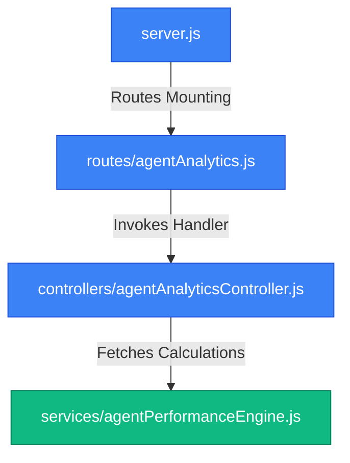
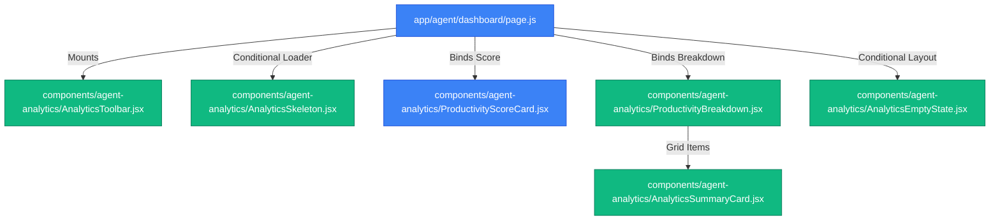

# File-Level Architecture: Agent Analytics Integration

This document traces the file-level architecture changes introduced for the Agent Analytics Backend.

---

## Mapped Modules & Files

### 1. Agent Analytics Service (Performance Engine)
- **Path**: [agentPerformanceEngine.js](file:///d:/mern/distributer/backend/services/agentPerformanceEngine.js) [NEW]
- **Role**: Computes metrics from raw database data.
- **Exports**:
  - `fetchAgentRecords(agentId)` (Utility)
  - `calculateCompletionMetrics(agentId)`
  - `calculateSLAMetrics(agentId)`
  - `calculateResolutionMetrics(agentId)`
  - `calculateProductivityScore(agentId)`

### 2. Agent Analytics API Routing
- **Path**: [agentAnalytics.js](file:///d:/mern/distributer/backend/routes/agentAnalytics.js) [MODIFY]
- **Role**: Directs requests to `/analytics` towards the controller. Implements standard `protect` and `restrictTo('agent')` guards.
- **Root Mounting Path**: mounted at `/api/agent-workspace` in [server.js](file:///d:/mern/distributer/backend/server.js).

### 3. Analytics Request Handler
- **Path**: [agentAnalyticsController.js](file:///d:/mern/distributer/backend/controllers/agentAnalyticsController.js) [MODIFY]
- **Role**: Coordinates calculation requests and responds with JSON structured metrics.
- **Calculations Flow**:
  1. Checks for a cache hit in local memory.
  2. If cache missed, runs engine calls concurrently via `Promise.all()`.
  3. Caches response payload for 5 minutes (300,000ms).
  4. Returns the result with the properties `productivity`, `completionMetrics`, `slaMetrics`, and `resolutionMetrics`.

---

## Mapped Frontend Modules & Files

### 1. Reusable Loader Skeleton
- **Path**: [AnalyticsSkeleton.jsx](file:///d:/mern/distributer/client/src/components/agent-analytics/AnalyticsSkeleton.jsx) [NEW]
- **Role**: Renders pulsing layout blocks for scores and summary cards during loading phases.

### 2. Summary Indicator Widget
- **Path**: [AnalyticsSummaryCard.jsx](file:///d:/mern/distributer/client/src/components/agent-analytics/AnalyticsSummaryCard.jsx) [NEW]
- **Role**: Formats individual metrics (title, value, subtitle, icon) with trend indicator badges.

### 3. Productivity Rating Score Card
- **Path**: [ProductivityScoreCard.jsx](file:///d:/mern/distributer/client/src/components/agent-analytics/ProductivityScoreCard.jsx) [MODIFY]
- **Role**: Displays score percentage, alphabetical grade badge with responsive coloring, and progress bar trackers.

### 4. Grid Breakdown Layout
- **Path**: [ProductivityBreakdown.jsx](file:///d:/mern/distributer/client/src/components/agent-analytics/ProductivityBreakdown.jsx) [NEW]
- **Role**: Groups four instances of the summary cards inside a responsive 2x2 grid representing Completion Rate, SLA Compliance, Speed, and Counts.

### 5. Control Toolbar & Empty Redirection
- **Path**: [AnalyticsToolbar.jsx](file:///d:/mern/distributer/client/src/components/agent-analytics/AnalyticsToolbar.jsx) [NEW]
  - **Role**: Action header showing refresh trigger buttons and time logs.
- **Path**: [AnalyticsEmptyState.jsx](file:///d:/mern/distributer/client/src/components/agent-analytics/AnalyticsEmptyState.jsx) [NEW]
  - **Role**: Standard view rendered when agent has no data, offering a CTA link redirecting back to the Workspace tasks tab.
