# File-Level Architecture: Agent Analytics Integration

This document traces the file-level architecture changes introduced for the Agent Analytics Backend.

---

## Mapped Modules & Files

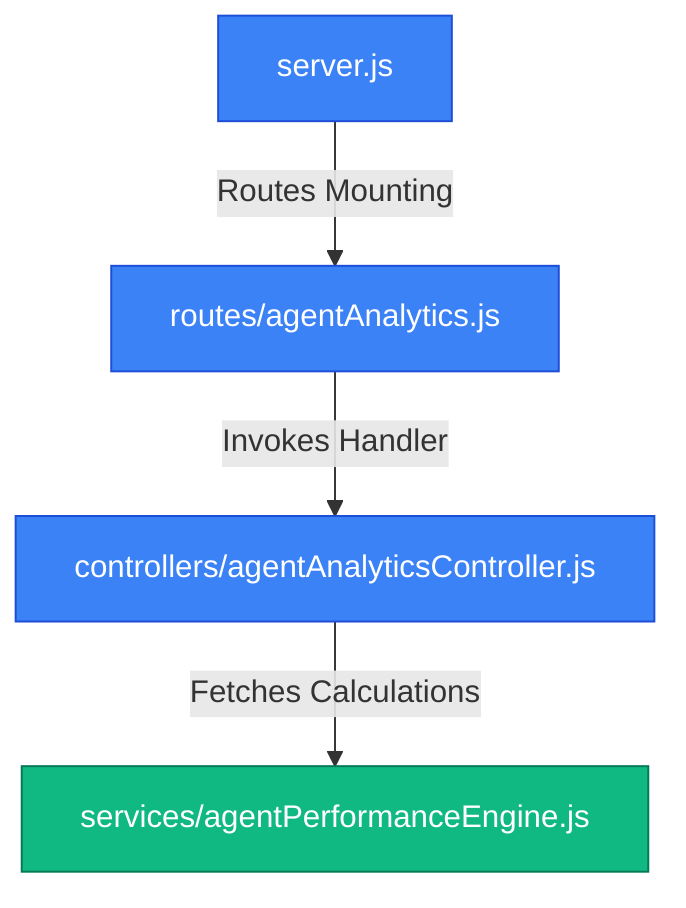

### 1. Agent Analytics Service (Performance Engine)
- **Path**: [agentPerformanceEngine.js](file:///d:/mern/distributer/backend/services/agentPerformanceEngine.js) [NEW]
- **Role**: Computes metrics from raw database data.
- **Exports**:
  - `fetchAgentRecords(agentId)` (Utility)
  - `calculateCompletionMetrics(agentId)`
  - `calculateSLAMetrics(agentId)`
  - `calculateResolutionMetrics(agentId)`
  - `calculateProductivityScore(agentId)`

### 2. Agent Analytics API Routing
- **Path**: [agentAnalytics.js](file:///d:/mern/distributer/backend/routes/agentAnalytics.js) [MODIFY]
- **Role**: Directs requests to `/analytics` towards the controller. Implements standard `protect` and `restrictTo('agent')` guards.
- **Root Mounting Path**: mounted at `/api/agent-workspace` in [server.js](file:///d:/mern/distributer/backend/server.js).

### 3. Analytics Request Handler
- **Path**: [agentAnalyticsController.js](file:///d:/mern/distributer/backend/controllers/agentAnalyticsController.js) [MODIFY]
- **Role**: Coordinates calculation requests and responds with JSON structured metrics.
- **Calculations Flow**:
  1. Checks for a cache hit in local memory.
  2. If cache missed, runs engine calls concurrently via `Promise.all()`.
  3. Caches response payload for 5 minutes (300,000ms).
  4. Returns the result with the properties `productivity`, `completionMetrics`, `slaMetrics`, and `resolutionMetrics`.

---

## Mapped Frontend Modules & Files

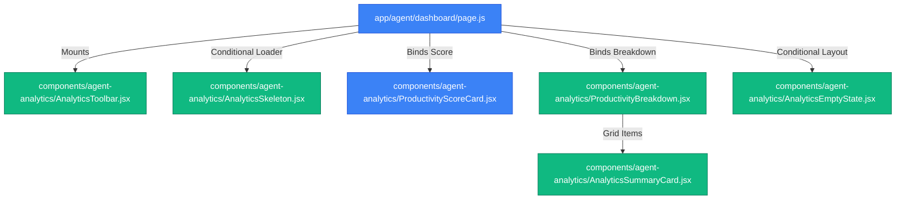

### 1. Reusable Loader Skeleton
- **Path**: [AnalyticsSkeleton.jsx](file:///d:/mern/distributer/client/src/components/agent-analytics/AnalyticsSkeleton.jsx) [NEW]
- **Role**: Renders pulsing layout blocks for scores and summary cards during loading phases.

### 2. Summary Indicator Widget
- **Path**: [AnalyticsSummaryCard.jsx](file:///d:/mern/distributer/client/src/components/agent-analytics/AnalyticsSummaryCard.jsx) [NEW]
- **Role**: Formats individual metrics (title, value, subtitle, icon) with trend indicator badges.

### 3. Productivity Rating Score Card
- **Path**: [ProductivityScoreCard.jsx](file:///d:/mern/distributer/client/src/components/agent-analytics/ProductivityScoreCard.jsx) [MODIFY]
- **Role**: Displays score percentage, alphabetical grade badge with responsive coloring, and progress bar trackers.

### 4. Grid Breakdown Layout
- **Path**: [ProductivityBreakdown.jsx](file:///d:/mern/distributer/client/src/components/agent-analytics/ProductivityBreakdown.jsx) [NEW]
- **Role**: Groups four instances of the summary cards inside a responsive 2x2 grid representing Completion Rate, SLA Compliance, Speed, and Counts.

### 5. Control Toolbar & Empty Redirection
- **Path**: [AnalyticsToolbar.jsx](file:///d:/mern/distributer/client/src/components/agent-analytics/AnalyticsToolbar.jsx) [NEW]
  - **Role**: Action header showing refresh trigger buttons and time logs.
- **Path**: [AnalyticsEmptyState.jsx](file:///d:/mern/distributer/client/src/components/agent-analytics/AnalyticsEmptyState.jsx) [NEW]
  - **Role**: Standard view rendered when agent has no data, offering a CTA link redirecting back to the Workspace tasks tab.

### 6. Workspace Rankings Panel
- **Path**: [RankingCard.jsx](file:///d:/mern/distributer/client/src/components/agent-analytics/RankingCard.jsx) [NEW]
  - **Role**: Display Global, Department, and Team Rank along with highlight leadership badges.

### 7. Performance Overlay Trend Chart
- **Path**: [PerformanceTrendChart.jsx](file:///d:/mern/distributer/client/src/components/agent-analytics/PerformanceTrendChart.jsx) [NEW/MODIFY]
  - **Role**: Custom SVG chart drawing comparative current vs previous lines for Weekly (14 days) and Monthly (8 weeks) periods. Supports PNG/SVG client-side downloads.

### 8. Delta Insights & Achievements Cards
- **Path**: [ImprovementInsights.jsx](file:///d:/mern/distributer/client/src/components/agent-analytics/ImprovementInsights.jsx) [NEW]
  - **Role**: Displays 30-day performance trends and rank movement deltas.
- **Path**: [PersonalBestCard.jsx](file:///d:/mern/distributer/client/src/components/agent-analytics/PersonalBestCard.jsx) [NEW]
  - **Role**: Showcases all-time records (highest score, peak task count, longest streak, fastest speed).

### 9. Trend Switcher Selector
- **Path**: [TrendSwitcher.jsx](file:///d:/mern/distributer/client/src/components/agent-analytics/TrendSwitcher.jsx) [NEW]
  - **Role**: Button toggle controlling the chart's Weekly/Monthly active state.

### 10. Snapshot Caching Schema
- **Path**: [AgentPerformanceSnapshot.js](file:///d:/mern/distributer/backend/models/AgentPerformanceSnapshot.js) [NEW]
  - **Role**: Persistent document schema enabling fast DB-level caching of historical performance.

### 11. AI Coaching & Recommendation Tracking Models
- **Path**: [AgentCoachingSnapshot.js](file:///d:/mern/distributer/backend/models/AgentCoachingSnapshot.js) [NEW]
  - **Role**: Stores generated AI/fallback coaching metrics, strengths, weaknesses, structured goals, focus area, and motivation message.
- **Path**: [CoachingAction.js](file:///d:/mern/distributer/backend/models/CoachingAction.js) [NEW]
  - **Role**: Tracks status (completed, saved, dismissed) of user interactions with coaching recommendations.

### 12. Coaching Routers and Controllers
- **Path**: [agentAI.js](file:///d:/mern/distributer/backend/routes/agentAI.js) [NEW]
  - **Role**: Defines endpoints for requesting coaching updates, history timeline, and recommendation updates.
- **Path**: [agentAICoachingController.js](file:///d:/mern/distributer/backend/controllers/agentAICoachingController.js) [NEW]
  - **Role**: Handles 15-minute refresh cooldown validations, merges recommendation progress statuses, and retrieves snapshots.
- **Path**: [agentCoachingEngine.js](file:///d:/mern/distributer/backend/services/agentCoachingEngine.js) [NEW]
  - **Role**: Combines metrics, generates LLM Groq payloads or runs rule-based engine fallbacks, and creates cache snapshots in the database.

### 13. Coaching UI Panels & Timeline
- **Path**: [CoachingSummaryCard.jsx](file:///d:/mern/distributer/client/src/components/agent-ai/CoachingSummaryCard.jsx) [NEW]
  - **Role**: Shows performance overview text, confidence indicators, motivation quotes, and rank/score improvement success animations.
- **Path**: [CoachingImpactCard.jsx](file:///d:/mern/distributer/client/src/components/agent-ai/CoachingImpactCard.jsx) [NEW]
  - **Role**: Measures coaching efficiency by tracking goals achieved, followed recommendations, and delta score deltas.
- **Path**: [RecommendationsPanel.jsx](file:///d:/mern/distributer/client/src/components/agent-ai/RecommendationsPanel.jsx) [NEW]
  - **Role**: Lists recommendations and lets agents trigger status updates (Complete, Save, Dismiss).
- **Path**: [GoalPlanner.jsx](file:///d:/mern/distributer/client/src/components/agent-ai/GoalPlanner.jsx) [NEW]
  - **Role**: Displays targeted upcoming goals with difficulty rating badges and estimated productivity index gains.
- **Path**: [CoachingTimeline.jsx](file:///d:/mern/distributer/client/src/components/agent-ai/CoachingTimeline.jsx) [NEW]
  - **Role**: Visualizes historical coaching scores and summaries over time.

### 14. Achievements & Gamification Modules
- **Path**: [Achievement.js](file:///d:/mern/distributer/backend/models/Achievement.js) [NEW]
  - **Role**: Mongoose schema for master achievements definitions.
- **Path**: [AgentAchievement.js](file:///d:/mern/distributer/backend/models/AgentAchievement.js) [NEW]
  - **Role**: tracks progress and unlocks for each agent-achievement mapping.
- **Path**: [achievementEngine.js](file:///d:/mern/distributer/backend/services/achievementEngine.js) [NEW]
  - **Role**: Calculates streaks, checks achievements thresholds, evaluates points/XP/level up, and triggers activity logging.
- **Path**: [gamificationController.js](file:///d:/mern/distributer/backend/controllers/gamificationController.js) [NEW]
  - **Role**: Exposes endpoints for profile state, achievements list, and milestones reward timeline.
- **Path**: [gamification.js](file:///d:/mern/distributer/backend/routes/gamification.js) [NEW]
  - **Role**: Handles router endpoints `/profile`, `/achievements`, and `/rewards`.

### 15. Achievements & Progression UI Components
- **Path**: [AgentLevelCard.jsx](file:///d:/mern/distributer/client/src/components/agent-achievements/AgentLevelCard.jsx) [NEW]
  - **Role**: Renders xp progress slider, level indicator, and points balance in a themed gradient card.
- **Path**: [StreakTracker.jsx](file:///d:/mern/distributer/client/src/components/agent-achievements/StreakTracker.jsx) [NEW]
  - **Role**: Renders current and longest streaks alongside a 7-day visual calendar grid.
- **Path**: [AchievementProgress.jsx](file:///d:/mern/distributer/client/src/components/agent-achievements/AchievementProgress.jsx) [NEW]
  - **Role**: Displays unlocked badge ratios and category breakdown summaries.
- **Path**: [AchievementGrid.jsx](file:///d:/mern/distributer/client/src/components/agent-achievements/AchievementGrid.jsx) [NEW]
  - **Role**: Renders collection cards for master achievements showing unlocked badges vs lock overlays.
- **Path**: [AchievementBadge.jsx](file:///d:/mern/distributer/client/src/components/agent-achievements/AchievementBadge.jsx) [NEW]
  - **Role**: Renders visual SVG badges styled conditionally by unlock state.
- **Path**: [RewardsTimeline.jsx](file:///d:/mern/distributer/client/src/components/agent-achievements/RewardsTimeline.jsx) [NEW]
  - **Role**: Shows checkpoint progression and points claims timeline.

### 16. Seasonal Leaderboard & Podium UI
- **Path**: [SeasonLeaderboard.jsx](file:///d:/mern/distributer/client/src/components/agent-achievements/SeasonLeaderboard.jsx) [NEW]
  - **Role**: Main container for seasonal standings. Toggles between Active Season, Weekly, Monthly, and All-Time leaderboards.
- **Path**: [LeaderboardPodium.jsx](file:///d:/mern/distributer/client/src/components/agent-achievements/LeaderboardPodium.jsx) [NEW]
  - **Role**: Premium podium layout showing the top 3 agents, including avatar slots, selected titles, levels, and composite scores.
- **Path**: [LeaderboardSeason.js](file:///d:/mern/distributer/backend/models/LeaderboardSeason.js) [NEW]
  - **Role**: Schema tracking active and past seasons (dates, top performers, reward parameters).
- **Path**: [leaderboardEngine.js](file:///d:/mern/distributer/backend/services/leaderboardEngine.js) [NEW]
  - **Role**: Computes composite rankings (Productivity + Completion + SLA) for periods and closes past seasons to distribute points automatically.

### 17. Challenges & Daily/Weekly Missions
- **Path**: [MissionTracker.jsx](file:///d:/mern/distributer/client/src/components/agent-achievements/MissionTracker.jsx) [NEW]
  - **Role**: Main view displaying active missions, filtering between Daily and Weekly.
- **Path**: [ChallengeCard.jsx](file:///d:/mern/distributer/client/src/components/agent-achievements/ChallengeCard.jsx) [NEW]
  - **Role**: Progress meter card rendering title, description, targets vs current values, and reward claim tags.
- **Path**: [Challenge.js](file:///d:/mern/distributer/backend/models/Challenge.js) [NEW]
  - **Role**: Model defining daily and weekly operations challenges.
- **Path**: [AgentChallenge.js](file:///d:/mern/distributer/backend/models/AgentChallenge.js) [NEW]
  - **Role**: Tracks individual agent progress, reset states, and completion status.
- **Path**: [challengeEngine.js](file:///d:/mern/distributer/backend/services/challengeEngine.js) [NEW]
  - **Role**: Seeds standard daily/weekly challenges and evaluates progress dynamically upon task completions.

### 18. Virtual Rewards Store & Custom Equips
- **Path**: [RewardStore.jsx](file:///d:/mern/distributer/client/src/components/agent-achievements/RewardStore.jsx) [NEW]
  - **Role**: Shop dashboard displaying point balance, item catalog, equipping triggers, and historical redemptions logs.
- **Path**: [RewardCard.jsx](file:///d:/mern/distributer/client/src/components/agent-achievements/RewardCard.jsx) [NEW]
  - **Role**: Formats catalog store item cards, showing point costs, preview areas, ownership statuses, and trigger actions.
- **Path**: [RewardHistory.jsx](file:///d:/mern/distributer/client/src/components/agent-achievements/RewardHistory.jsx) [NEW]
  - **Role**: Table list showing history log details of redeemed titles, themes, and badges.
- **Path**: [RewardCatalog.js](file:///d:/mern/distributer/backend/models/RewardCatalog.js) [NEW]
  - **Role**: Model storing unlockable custom titles, themes, and badges available in the store.
- **Path**: [RewardRedemption.js](file:///d:/mern/distributer/backend/models/RewardRedemption.js) [NEW]
  - **Role**: Model tracking completed redemption logs.
- **Path**: [rewardEngine.js](file:///d:/mern/distributer/backend/services/rewardEngine.js) [NEW]
  - **Role**: Seeds the rewards catalog, validates balances, records redemptions, and manages equipped title/theme overrides in agent user profiles.

---

## 19. Agent Collaboration & Communication Hub

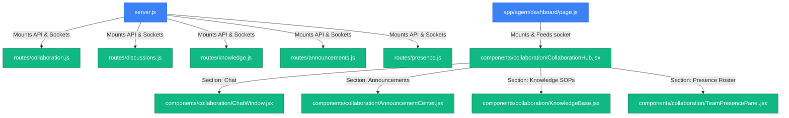

### Backend Models & Schemas
- **Path**: [TeamChannel.js](file:///d:/mern/distributer/backend/models/TeamChannel.js) [NEW]
  - **Role**: Mongoose schema for communication channels (General, Team-specific, and Department-specific).
- **Path**: [ChannelMessage.js](file:///d:/mern/distributer/backend/models/ChannelMessage.js) [NEW]
  - **Role**: Schema storing chat messages, including sender, reactions, mentions, attachments, and read receipts logs.
- **Path**: [TaskDiscussion.js](file:///d:/mern/distributer/backend/models/TaskDiscussion.js) [NEW]
  - **Role**: Schema managing task-threaded discussion comments, resolution statuses, and replies.
- **Path**: [SharedNote.js](file:///d:/mern/distributer/backend/models/SharedNote.js) [NEW]
  - **Role**: Schema storing collaborative wiki catalog notes and articles.
- **Path**: [Announcement.js](file:///d:/mern/distributer/backend/models/Announcement.js) [NEW]
  - **Role**: Schema managing priority scope-targeted administrative notices.

### Backend Routes & Sockets
- **Path**: [collaboration.js](file:///d:/mern/distributer/backend/routes/collaboration.js) [NEW]
  - **Role**: Implements channels roster querying and message history retrievals. Dynamic channel seeding hooks.
- **Path**: [discussions.js](file:///d:/mern/distributer/backend/routes/discussions.js) [NEW]
  - **Role**: Handles comments fetching and resolution toggle triggers for task records.
- **Path**: [knowledge.js](file:///d:/mern/distributer/backend/routes/knowledge.js) [NEW]
  - **Role**: Manages shared documents CRUD and tag querying.
- **Path**: [announcements.js](file:///d:/mern/distributer/backend/routes/announcements.js) [NEW]
  - **Role**: Exposes scope-matched announcements feeds.
- **Path**: [presence.js](file:///d:/mern/distributer/backend/routes/presence.js) [NEW]
  - **Role**: Retrieves real-time presence roster.
- **Path**: [server.js](file:///d:/mern/distributer/backend/server.js) [MODIFY]
  - **Role**: Hosts Socket.IO server, mounts API routers, and listens/broadcasts events (`join`, `join-channel`, `send-message`, `typing`, `presence-change`, `disconnect`).

### Frontend Components
- **Path**: [CollaborationHub.jsx](file:///d:/mern/distributer/client/src/components/collaboration/CollaborationHub.jsx) [NEW]
  - **Role**: Split-pane layout housing Chat, Announcements, Wiki Knowledge Base, and Presence tab panels.
- **Path**: [ChatWindow.jsx](file:///d:/mern/distributer/client/src/components/collaboration/ChatWindow.jsx) [NEW]
  - **Role**: Handles active channel stream rendering, message send events, typing indicators, and message edits/deletions.
- **Path**: [MessageBubble.jsx](file:///d:/mern/distributer/client/src/components/collaboration/MessageBubble.jsx) [NEW]
  - **Role**: Custom glassmorphic message card with avatars, equipped titles, reactions, and timestamp indicators.
- **Path**: [TypingIndicator.jsx](file:///d:/mern/distributer/client/src/components/collaboration/TypingIndicator.jsx) [NEW]
  - **Role**: Pulsing loading dots indicating which users are typing.
- **Path**: [TeamPresencePanel.jsx](file:///d:/mern/distributer/client/src/components/collaboration/TeamPresencePanel.jsx) [NEW]
  - **Role**: Lists current agents' live status, last seen values, and active console views.
- **Path**: [PresenceBadge.jsx](file:///d:/mern/distributer/client/src/components/collaboration/PresenceBadge.jsx) [NEW]
  - **Role**: Renders status dots/badges by status criteria.
- **Path**: [AnnouncementCenter.jsx](file:///d:/mern/distributer/client/src/components/collaboration/AnnouncementCenter.jsx) [NEW]
  - **Role**: Renders priority alerts, warning announcements, and mark-as-read updates.
- **Path**: [KnowledgeBase.jsx](file:///d:/mern/distributer/client/src/components/collaboration/KnowledgeBase.jsx) [NEW]
  - **Role**: Shared SOP wiki library catalog with interactive creation templates.
- **Path**: [SharedNotesBoard.jsx](file:///d:/mern/distributer/client/src/components/collaboration/SharedNotesBoard.jsx) [NEW]
  - **Role**: Grid display overview for note cards.
- **Path**: [TaskDiscussionPanel.jsx](file:///d:/mern/distributer/client/src/components/collaboration/TaskDiscussionPanel.jsx) [NEW]
  - **Role**: Renders side-drawer comments thread for task sheets.
- **Path**: [page.js](file:///d:/mern/distributer/client/src/app/agent/dashboard/page.js) [MODIFY]
  - **Role**: Agent dashboard core setup hosting socket.io, tracking active tab focus changes, and mounting `<CollaborationHub>`.

---

## 20. Agent AI Copilot & Smart Task Assistant

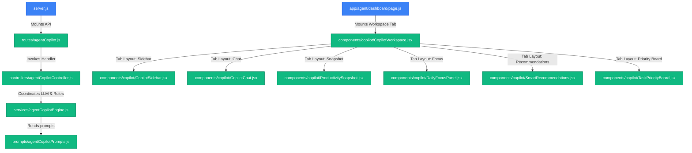

### Backend Models & Schemas
- **Path**: [AgentCopilotPreference.js](file:///d:/mern/distributer/backend/models/AgentCopilotPreference.js) [NEW]
  - **Role**: Stores agent working preferences and coaching memory tags for personalizing LLM suggestions.
- **Path**: [AgentCopilotSession.js](file:///d:/mern/distributer/backend/models/AgentCopilotSession.js) [NEW]
  - **Role**: Stores chat threads history, conversation titles, and message subdocuments.
- **Path**: [ActivityLog.js](file:///d:/mern/distributer/backend/models/ActivityLog.js) [MODIFY]
  - **Role**: Registered `COPILOT_CHAT_CREATED`, `COPILOT_RECOMMENDATION_USED`, `COPILOT_SUMMARY_GENERATED`, and `COPILOT_FOLLOWUP_GENERATED` enums to track engagement metrics.

### Backend Routes & Sockets
- **Path**: [agentCopilot.js](file:///d:/mern/distributer/backend/routes/agentCopilot.js) [NEW]
  - **Role**: Implements endpoints mapping summaries, chat, history threads, follow-up templates, and toggle/pin actions.
- **Path**: [agentCopilotController.js](file:///d:/mern/distributer/backend/controllers/agentCopilotController.js) [NEW]
  - **Role**: Coordinates route parameters, handles thread deletion/renaming, and fires live activity logging.
- **Path**: [agentCopilotEngine.js](file:///d:/mern/distributer/backend/services/agentCopilotEngine.js) [NEW]
  - **Role**: Computes risk parameters, applies a 15-minute memory cache, deduplicates concurrent requests, trims contexts, and calls Groq with robust rule-based local backup routines.
- **Path**: [agentCopilotPrompts.js](file:///d:/mern/distributer/backend/prompts/agentCopilotPrompts.js) [NEW]
  - **Role**: Structural prompt text library forcing Groq to output strict JSON schemas.

### Frontend Components
- **Path**: [CopilotWorkspace.jsx](file:///d:/mern/distributer/client/src/components/copilot/CopilotWorkspace.jsx) [NEW]
  - **Role**: Split-screen dashboard workspace connecting sidebar threads, chat feed, recommendations, priorities, and stats snapshot widget.
- **Path**: [CopilotSidebar.jsx](file:///d:/mern/distributer/client/src/components/copilot/CopilotSidebar.jsx) [NEW]
  - **Role**: Conversation list control supporting inline renaming, pin toggle sorting, search filtering, and thread deletions.
- **Path**: [CopilotChat.jsx](file:///d:/mern/distributer/client/src/components/copilot/CopilotChat.jsx) [NEW]
  - **Role**: Conversational bubble log with suggested prompt pills and access to PromptLibrary drawer.
- **Path**: [ChatMessage.jsx](file:///d:/mern/distributer/client/src/components/copilot/ChatMessage.jsx) [NEW]
  - **Role**: Renders individual chat message balloons with copy-to-clipboard actions.
- **Path**: [TypingIndicator.jsx](file:///d:/mern/distributer/client/src/components/copilot/TypingIndicator.jsx) [NEW]
  - **Role**: Pulsing animated loading bubbles.
- **Path**: [PromptLibrary.jsx](file:///d:/mern/distributer/client/src/components/copilot/PromptLibrary.jsx) [NEW]
  - **Role**: Grouped prompt helper templates supporting search and favorite logs.
- **Path**: [DailyFocusPanel.jsx](file:///d:/mern/distributer/client/src/components/copilot/DailyFocusPanel.jsx) [NEW]
  - **Role**: Renders daily summary, highlights, and target objectives.
- **Path**: [SmartRecommendations.jsx](file:///d:/mern/distributer/client/src/components/copilot/SmartRecommendations.jsx) [NEW]
  - **Role**: Lists executable task recommendations deep-linked with open/status update routes and follow-up templates generation.
- **Path**: [TaskPriorityBoard.jsx](file:///d:/mern/distributer/client/src/components/copilot/TaskPriorityBoard.jsx) [NEW]
  - **Role**: Risk board grid ordering tasks into Overdue, Due Today, and High Risk columns.
- **Path**: [ProductivitySnapshot.jsx](file:///d:/mern/distributer/client/src/components/copilot/ProductivitySnapshot.jsx) [NEW]
  - **Role**: Aggregates points, streaks, level, and scores from analytics and gamification.

---

## 10. Agent Learning Center & Career Growth Platform

This section maps the structural learning modules, certification checks, dynamic career progression logic, and dashboards.

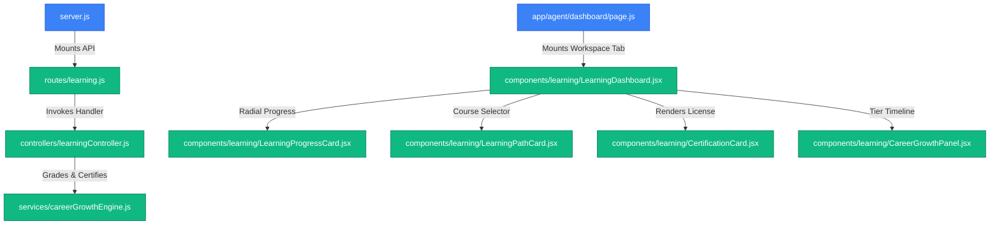

### Backend Models & Schemas
- **Path**: [LearningPath.js](file:///d:/mern/distributer/backend/models/LearningPath.js) [NEW]
  - **Role**: Stores default syllabus path configuration (Customer Communication, Task Management, SLA Excellence, Leadership, Productivity, AI Assisted Operations).
- **Path**: [LearningModule.js](file:///d:/mern/distributer/backend/models/LearningModule.js) [NEW]
  - **Role**: Stores specific modules, content text, order, and multiple-choice quiz questions.
- **Path**: [AgentLearningProgress.js](file:///d:/mern/distributer/backend/models/AgentLearningProgress.js) [NEW]
  - **Role**: Tracks module completion percentages, completed times, quiz scores, and study time spent.
- **Path**: [Certification.js](file:///d:/mern/distributer/backend/models/Certification.js) [NEW]
  - **Role**: Stores issued certificates, passing scores, unique codes, and issue timestamps.

### Backend Routes & Services
- **Path**: [learning.js](file:///d:/mern/distributer/backend/routes/learning.js) [NEW]
  - **Role**: Registers protected routes for paths, modules, progress submit, and career stats.
- **Path**: [learningController.js](file:///d:/mern/distributer/backend/controllers/learningController.js) [NEW]
  - **Role**: Coordinates seeding default paths, loads module details, evaluates quiz checkpoints, and aggregates statistics.
- **Path**: [careerGrowthEngine.js](file:///d:/mern/distributer/backend/services/careerGrowthEngine.js) [NEW]
  - **Role**: Computes Skill Score (completed paths ratio), Learning Velocity (30 days completed paths ratio), Career Tier criteria rules (Associate to Expert), Growth Index (composite metric), and auto-issues certifications with XP/points payouts.

### Frontend Components
- **Path**: [LearningDashboard.jsx](file:///d:/mern/distributer/client/src/components/learning/LearningDashboard.jsx) [NEW]
  - **Role**: Integrated panel holding active courses, radial progress overviews, quiz inputs, certified printouts, and career timelines.
- **Path**: [LearningPathCard.jsx](file:///d:/mern/distributer/client/src/components/learning/LearningPathCard.jsx) [NEW]
  - **Role**: Render card summaries with difficulty badges and completion bar indicators.
- **Path**: [LearningProgressCard.jsx](file:///d:/mern/distributer/client/src/components/learning/LearningProgressCard.jsx) [NEW]
  - **Role**: Summary stats dashboard containing inline radial SVG progress rings for active paths.
- **Path**: [CertificationCard.jsx](file:///d:/mern/distributer/client/src/components/learning/CertificationCard.jsx) [NEW]
  - **Role**: Premium verified glassmorphic certificate frame presenting license verification stamps.
- **Path**: [CareerGrowthPanel.jsx](file:///d:/mern/distributer/client/src/components/learning/CareerGrowthPanel.jsx) [NEW]
  - **Role**: Horizontal milestone path mapping Associate Agent up to Operations Expert status. Modifies tab navigation to display personalized DevelopmentPlanCard and MilestoneTracker components.

---

## 11. Learning Recommendations & AI Development Planner (Additional Commit 5)

This section maps the structural components added to personalize agent progression via AI-generated plans.

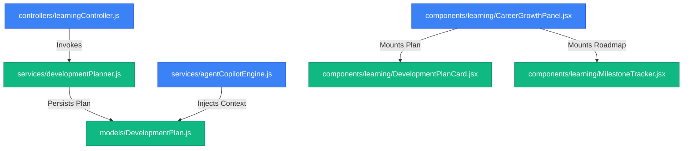

### Backend Models & Services
- **Path**: [DevelopmentPlan.js](file:///d:/mern/distributer/backend/models/DevelopmentPlan.js) [NEW]
  - **Role**: Schema storing current level, target level, recommended skills, recommended courses, estimated timeline, strengths, gaps, and weekly milestone subdocuments.
- **Path**: [developmentPlanner.js](file:///d:/mern/distributer/backend/services/developmentPlanner.js) [NEW]
  - **Role**: AI-driven development plan generation service querying metrics and invoking Groq API (or fallbacks) to save personalized career plans.
- **Path**: [learningController.js](file:///d:/mern/distributer/backend/controllers/learningController.js) [MODIFY]
  - **Role**: Implements `GET /development-plan` and `POST /regenerate-plan` routing handlers.
- **Path**: [agentCopilotEngine.js](file:///d:/mern/distributer/backend/services/agentCopilotEngine.js) [MODIFY]
  - **Role**: Injects development plan details and career stats into user chat prompts to answer career advancement questions.

### Frontend Components
- **Path**: [DevelopmentPlanCard.jsx](file:///d:/mern/distributer/client/src/components/learning/DevelopmentPlanCard.jsx) [NEW]
  - **Role**: Premium glassmorphic panel presenting strengths, gaps, target courses, and action triggers.
- **Path**: [MilestoneTracker.jsx](file:///d:/mern/distributer/client/src/components/learning/MilestoneTracker.jsx) [NEW]
  - **Role**: Action roadmap tracking weekly checkpoints with colored progress indicators.

---

## 12. Career Progression & Promotion Readiness (Commit 6)

This section maps the structural components added to evaluate career tiers, calculate promotion readiness, and present career checklists.

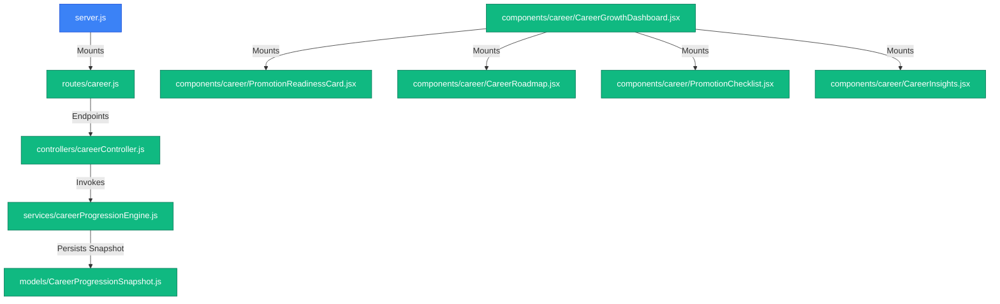

### Backend Models & Services
- **Path**: [CareerProgressionSnapshot.js](file:///d:/mern/distributer/backend/models/CareerProgressionSnapshot.js) [NEW]
  - **Role**: Database schema tracking readiness scores, levels, target tiers, strengths, weaknesses, checklists, and 4-week timelines.
- **Path**: [careerProgressionEngine.js](file:///d:/mern/distributer/backend/services/careerProgressionEngine.js) [NEW]
  - **Role**: Operations engine calculating consolidated readiness score using productivity (25%), learning (20%), achievements (15%), collaboration (10%), SLA (15%), and coaching (15%) metrics.
- **Path**: [careerController.js](file:///d:/mern/distributer/backend/controllers/careerController.js) [NEW]
  - **Role**: Implements API profile, readiness, roadmap, and force-regenerate actions.
- **Path**: [career.js](file:///d:/mern/distributer/backend/routes/career.js) [NEW]
  - **Role**: Routes /api/career requests.

### Frontend Components
- **Path**: [PromotionReadinessCard.jsx](file:///d:/mern/distributer/client/src/components/career/PromotionReadinessCard.jsx) [NEW]
  - **Role**: Renders overall promotion readiness percentage using a radial progress circle.
- **Path**: [CareerRoadmap.jsx](file:///d:/mern/distributer/client/src/components/career/CareerRoadmap.jsx) [NEW]
  - **Role**: Maps 4-week timeline checkpoints of actionable tasks alongside target skills and courses.
- **Path**: [PromotionChecklist.jsx](file:///d:/mern/distributer/client/src/components/career/PromotionChecklist.jsx) [NEW]
  - **Role**: Renders met and pending prerequisite checklists for next tier promotion.
- **Path**: [CareerInsights.jsx](file:///d:/mern/distributer/client/src/components/career/CareerInsights.jsx) [NEW]
  - **Role**: Displays positive strengths, development needs, and career goals.
- **Path**: [CareerGrowthDashboard.jsx](file:///d:/mern/distributer/client/src/components/career/CareerGrowthDashboard.jsx) [NEW]
  - **Role**: Orchestrates all subcomponent data fetching, manual snapshot regeneration triggers, and layout grid views.

---

## 13. Internal Talent Marketplace & Opportunity Engine (Commit 7)

This section maps the structural components added to manage internal opportunities, rank recommendations, and submit applications.

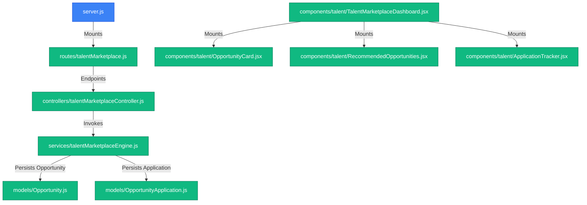

### Backend Models & Services
- **Path**: [Opportunity.js](file:///d:/mern/distributer/backend/models/Opportunity.js) [NEW]
  - **Role**: Database schema representing projects, assignments, mentorships, and programs.
- **Path**: [OpportunityApplication.js](file:///d:/mern/distributer/backend/models/OpportunityApplication.js) [NEW]
  - **Role**: Database schema tracking applications submitted by agents and status reviews.
- **Path**: [talentMarketplaceEngine.js](file:///d:/mern/distributer/backend/services/talentMarketplaceEngine.js) [NEW]
  - **Role**: Operations engine running default seedings and evaluating matchmaking percentages based on metrics (Productivity, Readiness, Learning, Achievements, Collab) and certification skills.
- **Path**: [talentMarketplaceController.js](file:///d:/mern/distributer/backend/controllers/talentMarketplaceController.js) [NEW]
  - **Role**: Implements endpoints for opportunities, ranked recommendations, applications tracker, and apply triggers.
- **Path**: [talentMarketplace.js](file:///d:/mern/distributer/backend/routes/talentMarketplace.js) [NEW]
  - **Role**: Route mapping for /api/talent-marketplace.

### Frontend Components
- **Path**: [OpportunityCard.jsx](file:///d:/mern/distributer/client/src/components/talent/OpportunityCard.jsx) [NEW]
  - **Role**: Renders opportunity metadata, categories, rewards, and checklist status indicators.
- **Path**: [RecommendedOpportunities.jsx](file:///d:/mern/distributer/client/src/components/talent/RecommendedOpportunities.jsx) [NEW]
  - **Role**: Displays AI matching ranked list of suggestions.
- **Path**: [ApplicationTracker.jsx](file:///d:/mern/distributer/client/src/components/talent/ApplicationTracker.jsx) [NEW]
  - **Role**: Status logs table summarizing applied opportunities and reviewer decisions.
- **Path**: [TalentMarketplaceDashboard.jsx](file:///d:/mern/distributer/client/src/components/talent/TalentMarketplaceDashboard.jsx) [NEW]
  - **Role**: Orchestrates all subcomponent states, API submissions, sub-tab selection triggers, and grid layouts.

---

## 14. Succession Planning & Leadership Pipeline Engine (Commit 8)

This section maps the structural components added to manage internal succession plans, identify high-potential candidates, and display ranked leadership pipelines on the admin console.

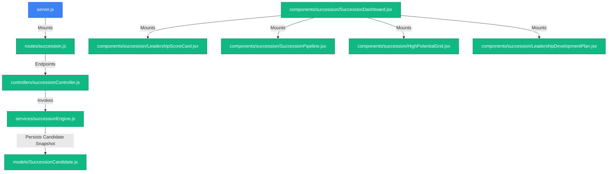

### Backend Models & Services
- **Path**: [SuccessionCandidate.js](file:///d:/mern/distributer/backend/models/SuccessionCandidate.js) [NEW]
  - **Role**: Database schema representing succession planning evaluations, scores, tiers, target roles, strengths, and weaknesses.
- **Path**: [successionEngine.js](file:///d:/mern/distributer/backend/services/successionEngine.js) [NEW]
  - **Role**: Operations engine calculating leadership score from metrics (Productivity 20%, Readiness 20%, Learning 15%, Collab 15%, Coaching 10%, Achievements 10%, Level 10%), identifying HiPo, and managing pipelines.
- **Path**: [successionController.js](file:///d:/mern/distributer/backend/controllers/successionController.js) [NEW]
  - **Role**: Implements endpoints for dashboard stats, candidates summaries, ranked pipelines, and forced recalculation triggers.
- **Path**: [succession.js](file:///d:/mern/distributer/backend/routes/succession.js) [NEW]
  - **Role**: Express route protection mapping endpoints.

### Frontend Components
- **Path**: [LeadershipScoreCard.jsx](file:///d:/mern/distributer/client/src/components/succession/LeadershipScoreCard.jsx) [NEW]
  - **Role**: Displays radial SVG leadership score gauge and succession tier tags.
- **Path**: [SuccessionPipeline.jsx](file:///d:/mern/distributer/client/src/components/succession/SuccessionPipeline.jsx) [NEW]
  - **Role**: Kanban-style lanes sorting candidates into Team Lead, Mentor, Department, and Operations pipelines.
- **Path**: [HighPotentialGrid.jsx](file:///d:/mern/distributer/client/src/components/succession/HighPotentialGrid.jsx) [NEW]
  - **Role**: Card grid rendering key strengths, targets, and scores for HiPo candidates.
- **Path**: [LeadershipDevelopmentPlan.jsx](file:///d:/mern/distributer/client/src/components/succession/LeadershipDevelopmentPlan.jsx) [NEW]
  - **Role**: Panel mapping strengths, focus zones, estimated timelines, and developmental action recommendations.
- **Path**: [SuccessionDashboard.jsx](file:///d:/mern/distributer/client/src/components/succession/SuccessionDashboard.jsx) [NEW]
  - **Role**: Admin console dashboard coordinating candidate data and recalculation updates.

---

## 15. Workforce Digital Twin & Scenario Simulation Engine (Commit 10)

This section maps the structural components added to manage dynamic workforce simulations, digital twin calculations, and strategic recommendation leaderboards in the admin dashboard workspace.

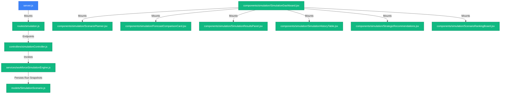

### Backend Models & Services
- **Path**: [SimulationScenario.js](file:///d:/mern/distributer/backend/models/SimulationScenario.js) [NEW]
  - **Role**: Database model representing simulated operations runs, configurations, forecasted parameters, and classifications.
- **Path**: [workforceSimulationEngine.js](file:///d:/mern/distributer/backend/services/workforceSimulationEngine.js) [NEW]
  - **Role**: Backend service containing the logic for SLA, Risk, Capacity, Health, and Suitability index calculations.
- **Path**: [simulationController.js](file:///d:/mern/distributer/backend/controllers/simulationController.js) [NEW]
  - **Role**: Controller managing requests for custom simulations, history logs, clearing runs, and strategic scenarios seeding.
- **Path**: [simulation.js](file:///d:/mern/distributer/backend/routes/simulation.js) [NEW]
  - **Role**: Express routing configuration restricting endpoints to `admin` scope.

### Frontend Components
- **Path**: [ScenarioPlanner.jsx](file:///d:/mern/distributer/client/src/components/simulation/ScenarioPlanner.jsx) [NEW]
  - **Role**: Inputs slider panel for hiring, releasing, automations, reallocations, and team setup names.
- **Path**: [ForecastComparisonCard.jsx](file:///d:/mern/distributer/client/src/components/simulation/ForecastComparisonCard.jsx) [NEW]
  - **Role**: Compares baseline operational parameters side-by-side with predicted values.
- **Path**: [SimulationResultsPanel.jsx](file:///d:/mern/distributer/client/src/components/simulation/SimulationResultsPanel.jsx) [NEW]
  - **Role**: Renders suitability ratings and detailed metrics change badges.
- **Path**: [SimulationHistoryTable.jsx](file:///d:/mern/distributer/client/src/components/simulation/SimulationHistoryTable.jsx) [NEW]
    Dashboard -->|Mounts| Roadmap
    Dashboard -->|Mounts| Checklist
    Dashboard -->|Mounts| Insights
```

### Backend Models & Services
- **Path**: [CareerProgressionSnapshot.js](file:///d:/mern/distributer/backend/models/CareerProgressionSnapshot.js) [NEW]
  - **Role**: Database schema tracking readiness scores, levels, target tiers, strengths, weaknesses, checklists, and 4-week timelines.
- **Path**: [careerProgressionEngine.js](file:///d:/mern/distributer/backend/services/careerProgressionEngine.js) [NEW]
  - **Role**: Operations engine calculating consolidated readiness score using productivity (25%), learning (20%), achievements (15%), collaboration (10%), SLA (15%), and coaching (15%) metrics.
- **Path**: [careerController.js](file:///d:/mern/distributer/backend/controllers/careerController.js) [NEW]
  - **Role**: Implements API profile, readiness, roadmap, and force-regenerate actions.
- **Path**: [career.js](file:///d:/mern/distributer/backend/routes/career.js) [NEW]
  - **Role**: Routes /api/career requests.

### Frontend Components
- **Path**: [PromotionReadinessCard.jsx](file:///d:/mern/distributer/client/src/components/career/PromotionReadinessCard.jsx) [NEW]
  - **Role**: Renders overall promotion readiness percentage using a radial progress circle.
- **Path**: [CareerRoadmap.jsx](file:///d:/mern/distributer/client/src/components/career/CareerRoadmap.jsx) [NEW]
  - **Role**: Maps 4-week timeline checkpoints of actionable tasks alongside target skills and courses.
- **Path**: [PromotionChecklist.jsx](file:///d:/mern/distributer/client/src/components/career/PromotionChecklist.jsx) [NEW]
  - **Role**: Renders met and pending prerequisite checklists for next tier promotion.
- **Path**: [CareerInsights.jsx](file:///d:/mern/distributer/client/src/components/career/CareerInsights.jsx) [NEW]
  - **Role**: Displays positive strengths, development needs, and career goals.
- **Path**: [CareerGrowthDashboard.jsx](file:///d:/mern/distributer/client/src/components/career/CareerGrowthDashboard.jsx) [NEW]
  - **Role**: Orchestrates all subcomponent data fetching, manual snapshot regeneration triggers, and layout grid views.

---

## 13. Internal Talent Marketplace & Opportunity Engine (Commit 7)

This section maps the structural components added to manage internal opportunities, rank recommendations, and submit applications.


### Backend Models & Services
- **Path**: [Opportunity.js](file:///d:/mern/distributer/backend/models/Opportunity.js) [NEW]
  - **Role**: Database schema representing projects, assignments, mentorships, and programs.
- **Path**: [OpportunityApplication.js](file:///d:/mern/distributer/backend/models/OpportunityApplication.js) [NEW]
  - **Role**: Database schema tracking applications submitted by agents and status reviews.
- **Path**: [talentMarketplaceEngine.js](file:///d:/mern/distributer/backend/services/talentMarketplaceEngine.js) [NEW]
  - **Role**: Operations engine running default seedings and evaluating matchmaking percentages based on metrics (Productivity, Readiness, Learning, Achievements, Collab) and certification skills.
- **Path**: [talentMarketplaceController.js](file:///d:/mern/distributer/backend/controllers/talentMarketplaceController.js) [NEW]
  - **Role**: Implements endpoints for opportunities, ranked recommendations, applications tracker, and apply triggers.
- **Path**: [talentMarketplace.js](file:///d:/mern/distributer/backend/routes/talentMarketplace.js) [NEW]
  - **Role**: Route mapping for /api/talent-marketplace.

### Frontend Components
- **Path**: [OpportunityCard.jsx](file:///d:/mern/distributer/client/src/components/talent/OpportunityCard.jsx) [NEW]
  - **Role**: Renders opportunity metadata, categories, rewards, and checklist status indicators.
- **Path**: [RecommendedOpportunities.jsx](file:///d:/mern/distributer/client/src/components/talent/RecommendedOpportunities.jsx) [NEW]
  - **Role**: Displays AI matching ranked list of suggestions.
- **Path**: [ApplicationTracker.jsx](file:///d:/mern/distributer/client/src/components/talent/ApplicationTracker.jsx) [NEW]
  - **Role**: Status logs table summarizing applied opportunities and reviewer decisions.
- **Path**: [TalentMarketplaceDashboard.jsx](file:///d:/mern/distributer/client/src/components/talent/TalentMarketplaceDashboard.jsx) [NEW]
  - **Role**: Orchestrates all subcomponent states, API submissions, sub-tab selection triggers, and grid layouts.

---

## 14. Succession Planning & Leadership Pipeline Engine (Commit 8)

This section maps the structural components added to manage internal succession plans, identify high-potential candidates, and display ranked leadership pipelines on the admin console.


### Backend Models & Services
- **Path**: [SuccessionCandidate.js](file:///d:/mern/distributer/backend/models/SuccessionCandidate.js) [NEW]
  - **Role**: Database schema representing succession planning evaluations, scores, tiers, target roles, strengths, and weaknesses.
- **Path**: [successionEngine.js](file:///d:/mern/distributer/backend/services/successionEngine.js) [NEW]
  - **Role**: Operations engine calculating leadership score from metrics (Productivity 20%, Readiness 20%, Learning 15%, Collab 15%, Coaching 10%, Achievements 10%, Level 10%), identifying HiPo, and managing pipelines.
- **Path**: [successionController.js](file:///d:/mern/distributer/backend/controllers/successionController.js) [NEW]
  - **Role**: Implements endpoints for dashboard stats, candidates summaries, ranked pipelines, and forced recalculation triggers.
- **Path**: [succession.js](file:///d:/mern/distributer/backend/routes/succession.js) [NEW]
  - **Role**: Express route protection mapping endpoints.

### Frontend Components
- **Path**: [LeadershipScoreCard.jsx](file:///d:/mern/distributer/client/src/components/succession/LeadershipScoreCard.jsx) [NEW]
  - **Role**: Displays radial SVG leadership score gauge and succession tier tags.
- **Path**: [SuccessionPipeline.jsx](file:///d:/mern/distributer/client/src/components/succession/SuccessionPipeline.jsx) [NEW]
  - **Role**: Kanban-style lanes sorting candidates into Team Lead, Mentor, Department, and Operations pipelines.
- **Path**: [HighPotentialGrid.jsx](file:///d:/mern/distributer/client/src/components/succession/HighPotentialGrid.jsx) [NEW]
  - **Role**: Card grid rendering key strengths, targets, and scores for HiPo candidates.
- **Path**: [LeadershipDevelopmentPlan.jsx](file:///d:/mern/distributer/client/src/components/succession/LeadershipDevelopmentPlan.jsx) [NEW]
  - **Role**: Panel mapping strengths, focus zones, estimated timelines, and developmental action recommendations.
- **Path**: [SuccessionDashboard.jsx](file:///d:/mern/distributer/client/src/components/succession/SuccessionDashboard.jsx) [NEW]
  - **Role**: Admin console dashboard coordinating candidate data and recalculation updates.

---

## 15. Workforce Digital Twin & Scenario Simulation Engine (Commit 10)

This section maps the structural components added to manage dynamic workforce simulations, digital twin calculations, and strategic recommendation leaderboards in the admin dashboard workspace.


### Backend Models & Services
- **Path**: [SimulationScenario.js](file:///d:/mern/distributer/backend/models/SimulationScenario.js) [NEW]
  - **Role**: Database model representing simulated operations runs, configurations, forecasted parameters, and classifications.
- **Path**: [workforceSimulationEngine.js](file:///d:/mern/distributer/backend/services/workforceSimulationEngine.js) [NEW]
  - **Role**: Backend service containing the logic for SLA, Risk, Capacity, Health, and Suitability index calculations.
- **Path**: [simulationController.js](file:///d:/mern/distributer/backend/controllers/simulationController.js) [NEW]
  - **Role**: Controller managing requests for custom simulations, history logs, clearing runs, and strategic scenarios seeding.
- **Path**: [simulation.js](file:///d:/mern/distributer/backend/routes/simulation.js) [NEW]
  - **Role**: Express routing configuration restricting endpoints to `admin` scope.

### Frontend Components
- **Path**: [ScenarioPlanner.jsx](file:///d:/mern/distributer/client/src/components/simulation/ScenarioPlanner.jsx) [NEW]
  - **Role**: Inputs slider panel for hiring, releasing, automations, reallocations, and team setup names.
- **Path**: [ForecastComparisonCard.jsx](file:///d:/mern/distributer/client/src/components/simulation/ForecastComparisonCard.jsx) [NEW]
  - **Role**: Compares baseline operational parameters side-by-side with predicted values.
- **Path**: [SimulationResultsPanel.jsx](file:///d:/mern/distributer/client/src/components/simulation/SimulationResultsPanel.jsx) [NEW]
  - **Role**: Renders suitability ratings and detailed metrics change badges.
- **Path**: [SimulationHistoryTable.jsx](file:///d:/mern/distributer/client/src/components/simulation/SimulationHistoryTable.jsx) [NEW]
  - **Role**: Records and displays past custom simulations ran by administrative leaders.
- **Path**: [StrategicRecommendations.jsx](file:///d:/mern/distributer/client/src/components/simulation/StrategicRecommendations.jsx) [NEW]
  - **Role**: Displays cards summarizing Recommended, Best Case, and Worst Case operational profiles.
- **Path**: [ScenarioRankingBoard.jsx](file:///d:/mern/distributer/client/src/components/simulation/ScenarioRankingBoard.jsx) [NEW]
  - **Role**: Suitability leaderboard sorting all active strategic and customized plans.
- **Path**: [SimulationDashboard.jsx](file:///d:/mern/distributer/client/src/components/simulation/SimulationDashboard.jsx) [NEW]
  - **Role**: Coordinates data loading, simulator executions, history clearing, and layout grids.

---

## 16. Organizational Network Intelligence (ONI) (Commit 11)

This section maps the structural components added to manage team collaboration patterns, communication networks, knowledge flows, dynamic risk audits, connectivity matrix heatmaps, and network influencers rosters.

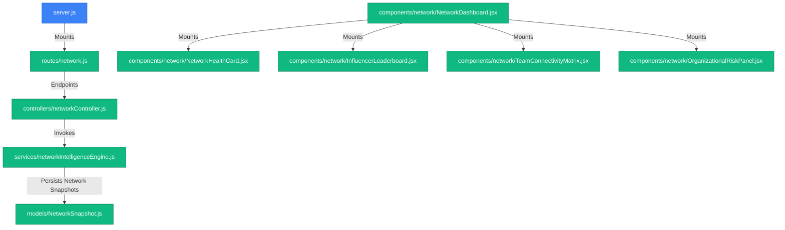

### Backend Models & Services
- **Path**: [NetworkSnapshot.js](file:///d:/mern/distributer/backend/models/NetworkSnapshot.js) [NEW]
  - **Role**: Database model representing network collaboration scores, knowledge flow indices, department interaction metrics, and communication risk summaries.
- **Path**: [networkIntelligenceEngine.js](file:///d:/mern/distributer/backend/services/networkIntelligenceEngine.js) [NEW]
  - **Role**: Graph building and calculation logic assessing message, task thread, SOP wiki, and mentorship connections. Also evaluates isolated users, knowledge silos, and connectivity matrices.
- **Path**: [networkController.js](file:///d:/mern/distributer/backend/controllers/networkController.js) [NEW]
  - **Role**: Controller implementing endpoints for health metrics, influencer rosters, department bottleneck risks, and department connectivity heatmaps.
- **Path**: [network.js](file:///d:/mern/distributer/backend/routes/network.js) [NEW]
  - **Role**: Routing definitions protecting network intelligence statistics.

### Frontend Components
- **Path**: [NetworkHealthCard.jsx](file:///d:/mern/distributer/client/src/components/network/NetworkHealthCard.jsx) [NEW]
  - **Role**: Displays overall network health gauges and indicators for collaboration, engagement, and knowledge flow.
- **Path**: [InfluencerLeaderboard.jsx](file:///d:/mern/distributer/client/src/components/network/InfluencerLeaderboard.jsx) [NEW]
  - **Role**: Rankings roster highlighting top collaborators, mentors, knowledge builders, and communication champions.
- **Path**: [TeamConnectivityMatrix.jsx](file:///d:/mern/distributer/client/src/components/network/TeamConnectivityMatrix.jsx) [NEW]
  - **Role**: Interactive color-shaded matrix heatmap representing inter-department collaboration volumes.
- **Path**: [OrganizationalRiskPanel.jsx](file:///d:/mern/distributer/client/src/components/network/OrganizationalRiskPanel.jsx) [NEW]
  - **Role**: Panel auditing operational risk factors like isolated nodes, low engagement users, department bottlenecks, and knowledge silos.
- **Path**: [NetworkDashboard.jsx](file:///d:/mern/distributer/client/src/components/network/NetworkDashboard.jsx) [NEW]
  - **Role**: Main administrative workspace coordinating network API payloads and grid renders.
