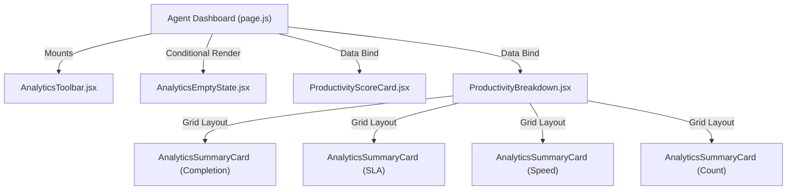

# Project Analysis: Agent Analytics Foundation

This document details the analysis and design of the Agent Analytics Backend Foundation, including calculations, formulas, database indexing, and API structure.

---

## 1. Agent Analytics Service

The **Agent Analytics Service** is a reusable calculation module built inside [agentPerformanceEngine.js](file:///d:/mern/distributer/backend/services/agentPerformanceEngine.js). It aggregates user assignments and performs non-blocking calculations to retrieve:
1. **Completion Metrics**: The number of assigned, completed, and pending records, alongside the overall completion rate.
2. **SLA Compliance**: Evaluates tasks against their due dates to check compliance.
3. **Resolution Metrics**: Evaluates duration (in hours) between initial assignment (`assignedAt`) and completion (`completedAt` or `updatedAt`).

### Database Queries & Aggregation
To maintain performance:
- The service queries the `Distribution` schema using indexing on `agents.agentId`:
  ```javascript
  const distributions = await Distribution.find({ 'agents.agentId': agentId });
  ```
- Reusable arrays of records are filtered locally using JavaScript array operations to avoid multiple heavy round-trips to MongoDB.

---

## 2. Productivity Score Engine

The Productivity Score Engine calculates a consolidated score from 0 to 100 representing an agent's overall performance.

### Weighted Formula
The score is calculated using the following weights:
- **Completion Rate**: `40%`
- **SLA Compliance**: `35%`
- **Activity Participation**: `15%`
- **Resolution Speed**: `10%`

$$ProductivityScore = (CompletionRate \times 0.40) + (SLACompliance \times 0.35) + (ActivityParticipation \times 0.15) + (ResolutionSpeed \times 0.10)$$

### Metrics Evaluation Details:
1. **Completion Rate**: Percentage of assigned records marked as `completed`.
2. **SLA Compliance**: Percentage of completed tasks that were completed before or on their `dueDate`. Completed tasks without a due date are considered on time. Defaults to `100` if no tasks are completed.
3. **Activity Participation**: Based on the agent's interaction frequency. Checked via `ActivityLog` entries where `performedBy` matches the agent within the last 30 days. Benchmark: 30 logged events in 30 days = 100%.
4. **Resolution Speed Score**: Based on the `averageResolutionHours`:
   - $\le 2$ hours: `100`
   - $\le 6$ hours: `90`
   - $\le 12$ hours: `80`
   - $\le 24$ hours: `70`
   - $\le 48$ hours: `50`
   - $> 48$ hours: `30`
   - No completed tasks: `100` (Optimal default)

### Grading Schema:
- **A+**: $\ge 95$
- **A**: $\ge 90$
- **B**: $\ge 80$
- **C**: $\ge 70$
- **D**: $< 70$

---

## 3. Agent Analytics API

The Agent Analytics API exposes calculated metrics to the agent portal.

### Endpoint Specifications
- **URL**: `GET /api/agent-workspace/analytics`
- **Auth**: Protected (Requires valid JWT token in `Authorization: Bearer <token>`)
- **Role Permissions**: Restricted to `agent` role.
- **Cache Policy**: 5-minute memory caching on the server side to minimize MongoDB query load during frequent page reloads.

### Sample API Response Payload
```json
{
  "success": true,
  "cached": false,
  "productivity": {
    "score": 92,
    "grade": "A"
  },
  "completionMetrics": {
    "totalAssigned": 15,
    "completed": 12,
    "pending": 3,
    "completionRate": 80
  },
  "slaMetrics": {
    "onTimeCompleted": 10,
    "lateCompleted": 2,
    "slaCompliance": 83
  },
  "resolutionMetrics": {
    "averageResolutionHours": 4.5,
    "fastestResolutionHours": 1.2,
    "slowestResolutionHours": 18.4
  }
}
```

---

## 4. Agent Analytics Dashboard UI Architecture

The frontend is integrated as a dedicated tab inside the Agent Console Dashboard. It leverages Next.js Client Components and responsive grids to render real-time performance analytics.



### Session Caching Flow
To reduce API request frequency, the dashboard stores response payloads locally:
1. **Cache Read**: On active tab transition or dashboard reload, the client checks `window.sessionStorage` under `agent_analytics_cache`.
2. **TTL Verification**: The cached payload is checked against a 5-minute TTL (Time-To-Live).
3. **Optimistic Loading**: If the cache is valid, the UI loads immediately.
4. **Background Refresh**: If the cache exists but is expired, it displays the cached data first, then triggers a background fetch to update the UI and rewrite the cache.
5. **Invalidation**: Clicking the "Refresh Metrics" action in `AnalyticsToolbar` bypasses the cache, forcing an API fetch.

---

## 5. Productivity KPI Rendering Flow

Metrics are calculated and rendered dynamically through specialized sub-components:
- **AnalyticsSkeleton**: Displays loading shells with pulsing animation.
- **ProductivityScoreCard**: Renders the final score and uses a gradient background matching the grade system (A+ = Emerald, A = Green, B = Blue, C = Amber, D = Red).
- **ProductivityBreakdown**: Configures a 2x2 grid containing four instances of `AnalyticsSummaryCard` representing Completion, SLA, Resolution Time, and Completed Counts. Displays trend indicator flags (▲ Improved, ▼ Declined, ▬ Stable) when comparative datasets are passed.
- **AnalyticsEmptyState**: Displays if the agent has not completed any tasks. Features an illustration and a "Go To Tasks" CTA to redirect back to the workspace queue.

## 6. Historical Performance Snapshot Cache

To prevent expensive recalculation of past performance indices (Productivity Score, SLA Compliance, Completion Rate, and Rank), the system utilizes a persistent snapshot layer (`AgentPerformanceSnapshot` model).
- **Auto-Generation**: During analytics request processing, the engine identifies any days/weeks in the target ranges lacking a snapshot and calculates them in-memory from past distribution history, then stores the snapshot in the database.
- **Normalizing Date Keys**: Snape dates (`generatedAt`) are normalized to Midnight (`00:00:00.000`) for robust uniqueness and cache lookup indexing.

---

## 7. Dynamic Ranking & Rank Movement

Agents are ranked against their workspace peers using a composite performance score:
$$RankScore = ProductivityScore + CompletionRate + SLACompliance$$

- **Global, Department, and Team Ranks**: The engine filters, orders, and ranks agents at the Global, Department, and Team levels.
- **Rank Movement**: The system compares current rank with rank 30 days ago, calculating rank direction (up/down/stable) and delta magnitude (e.g. `Moved up 4 positions`).
- **Leader Badges**: Rendered client-side on the `RankingCard` (e.g., `#1` in department triggers a `Department Leader` badge).

---

## 8. Trend Comparison Engine & Personal Bests

- **Overlay Comparison**: The `PerformanceTrendChart` visualizes current weekly/monthly lines alongside dashed lines representing previous period performance curves.
- **Personal Achievements**: An in-memory achievements engine calculates and lists peak scores, streak durations, best completion volumes, and speed records inside `PersonalBestCard`.

---

## 9. Adoption Auditing

Adoption statistics are logged directly into `ActivityLog` to analyze usage:
- `AGENT_ANALYTICS_VIEWED`: Emitted upon standard analytics page loads.
- `PERFORMANCE_REPORT_VIEWED`: Emitted when forcing manual refreshes (refresh button).

---

## 10. Agent Coaching Engine & Productivity Insights

The **Agent Coaching Engine** transforms raw analytical measurements into actionable recommendations and structured goals, implementing a premium personal coaching experience.

### AI Coaching Flow & Fallback Architecture
- **API Endpoint**: `GET /api/agent-ai/coaching`
- **AI Synthesis**: Leverages the Groq API service (`callGroq`) with a detailed system prompt defining strict schema formats. Inputs include historical trends, ranking movement, and productivity metrics.
- **Rule-Based Fallback**: If the AI request times out or returns malformed structures, the service triggers the fallback engine (`generateRuleBasedCoaching`) to generate custom rule-based insights dynamically. This ensures that the frontend never encounters rendering breaks.

### Coaching Snapshot Cache & Refresh Protection
- **Snapshot Persistence**: Generated coaching insights are stored inside `AgentCoachingSnapshot` to enable history tracking, and prevent redundant generation calls.
- **Smart Refresh Cooldown**: To protect against redundant LLM API rate limit hits, a `15-minute refresh cooldown` is enforced. Fresh calls are blocked during this window, and the cache is served directly from the database snapshot.

### Recommendation Action Tracking
- The system supports recommendation status updates (Complete, Save for Later, Dismiss) stored in `CoachingAction` collection.
- Statuses are merged dynamically into recommendation lists returned by the API.

### Goal Difficulty & Impact System
- Goals are saved as structured objects with difficulty ratings (`easy`, `medium`, `hard`) and estimated score impacts (e.g. `+15%`), mapping gamified targets dynamically.

### Coaching Impact Analytics & Weekly Timeline
- **ROI Impact Tracking**: The dashboard displays followed recommendations, achieved targets, and productivity score deltas as tangible coaching business value.
- **Weekly History Timeline**: Renders past weeks' snapshots in a vertical timeline, showing historical scores, summaries, and focus areas.
