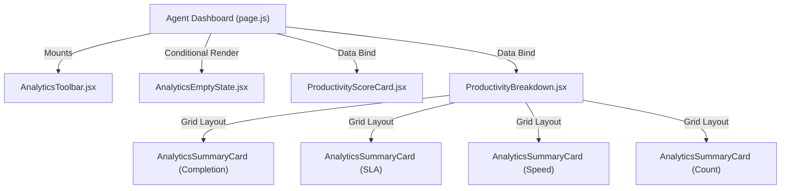

# Project Analysis: Agent Analytics Foundation

This document details the analysis and design of the Agent Analytics Backend Foundation, including calculations, formulas, database indexing, and API structure.

---

## 1. Agent Analytics Service

The **Agent Analytics Service** is a reusable calculation module built inside [agentPerformanceEngine.js](file:///d:/mern/distributer/backend/services/agentPerformanceEngine.js). It aggregates user assignments and performs non-blocking calculations to retrieve:
1. **Completion Metrics**: The number of assigned, completed, and pending records, alongside the overall completion rate.
2. **SLA Compliance**: Evaluates tasks against their due dates to check compliance.
3. **Resolution Metrics**: Evaluates duration (in hours) between initial assignment (`assignedAt`) and completion (`completedAt` or `updatedAt`).

### Database Queries & Aggregation
To maintain performance:
- The service queries the `Distribution` schema using indexing on `agents.agentId`:
  ```javascript
  const distributions = await Distribution.find({ 'agents.agentId': agentId });
  ```
- Reusable arrays of records are filtered locally using JavaScript array operations to avoid multiple heavy round-trips to MongoDB.

---

## 2. Productivity Score Engine

The Productivity Score Engine calculates a consolidated score from 0 to 100 representing an agent's overall performance.

### Weighted Formula
The score is calculated using the following weights:
- **Completion Rate**: `40%`
- **SLA Compliance**: `35%`
- **Activity Participation**: `15%`
- **Resolution Speed**: `10%`

$$ProductivityScore = (CompletionRate \times 0.40) + (SLACompliance \times 0.35) + (ActivityParticipation \times 0.15) + (ResolutionSpeed \times 0.10)$$

### Metrics Evaluation Details:
1. **Completion Rate**: Percentage of assigned records marked as `completed`.
2. **SLA Compliance**: Percentage of completed tasks that were completed before or on their `dueDate`. Completed tasks without a due date are considered on time. Defaults to `100` if no tasks are completed.
3. **Activity Participation**: Based on the agent's interaction frequency. Checked via `ActivityLog` entries where `performedBy` matches the agent within the last 30 days. Benchmark: 30 logged events in 30 days = 100%.
4. **Resolution Speed Score**: Based on the `averageResolutionHours`:
   - $\le 2$ hours: `100`
   - $\le 6$ hours: `90`
   - $\le 12$ hours: `80`
   - $\le 24$ hours: `70`
   - $\le 48$ hours: `50`
   - $> 48$ hours: `30`
   - No completed tasks: `100` (Optimal default)

### Grading Schema:
- **A+**: $\ge 95$
- **A**: $\ge 90$
- **B**: $\ge 80$
- **C**: $\ge 70$
- **D**: $< 70$

---

## 3. Agent Analytics API

The Agent Analytics API exposes calculated metrics to the agent portal.

### Endpoint Specifications
- **URL**: `GET /api/agent-workspace/analytics`
- **Auth**: Protected (Requires valid JWT token in `Authorization: Bearer <token>`)
- **Role Permissions**: Restricted to `agent` role.
- **Cache Policy**: 5-minute memory caching on the server side to minimize MongoDB query load during frequent page reloads.

### Sample API Response Payload
```json
{
  "success": true,
  "cached": false,
  "productivity": {
    "score": 92,
    "grade": "A"
  },
  "completionMetrics": {
    "totalAssigned": 15,
    "completed": 12,
    "pending": 3,
    "completionRate": 80
  },
  "slaMetrics": {
    "onTimeCompleted": 10,
    "lateCompleted": 2,
    "slaCompliance": 83
  },
  "resolutionMetrics": {
    "averageResolutionHours": 4.5,
    "fastestResolutionHours": 1.2,
    "slowestResolutionHours": 18.4
  }
}
```

---

## 4. Agent Analytics Dashboard UI Architecture

The frontend is integrated as a dedicated tab inside the Agent Console Dashboard. It leverages Next.js Client Components and responsive grids to render real-time performance analytics.



### Session Caching Flow
To reduce API request frequency, the dashboard stores response payloads locally:
1. **Cache Read**: On active tab transition or dashboard reload, the client checks `window.sessionStorage` under `agent_analytics_cache`.
2. **TTL Verification**: The cached payload is checked against a 5-minute TTL (Time-To-Live).
3. **Optimistic Loading**: If the cache is valid, the UI loads immediately.
4. **Background Refresh**: If the cache exists but is expired, it displays the cached data first, then triggers a background fetch to update the UI and rewrite the cache.
5. **Invalidation**: Clicking the "Refresh Metrics" action in `AnalyticsToolbar` bypasses the cache, forcing an API fetch.

---

## 5. Productivity KPI Rendering Flow

Metrics are calculated and rendered dynamically through specialized sub-components:
- **AnalyticsSkeleton**: Displays loading shells with pulsing animation.
- **ProductivityScoreCard**: Renders the final score and uses a gradient background matching the grade system (A+ = Emerald, A = Green, B = Blue, C = Amber, D = Red).
- **ProductivityBreakdown**: Configures a 2x2 grid containing four instances of `AnalyticsSummaryCard` representing Completion, SLA, Resolution Time, and Completed Counts. Displays trend indicator flags (▲ Improved, ▼ Declined, ▬ Stable) when comparative datasets are passed.
- **AnalyticsEmptyState**: Displays if the agent has not completed any tasks. Features an illustration and a "Go To Tasks" CTA to redirect back to the workspace queue.

## 6. Historical Performance Snapshot Cache

To prevent expensive recalculation of past performance indices (Productivity Score, SLA Compliance, Completion Rate, and Rank), the system utilizes a persistent snapshot layer (`AgentPerformanceSnapshot` model).
- **Auto-Generation**: During analytics request processing, the engine identifies any days/weeks in the target ranges lacking a snapshot and calculates them in-memory from past distribution history, then stores the snapshot in the database.
- **Normalizing Date Keys**: Snape dates (`generatedAt`) are normalized to Midnight (`00:00:00.000`) for robust uniqueness and cache lookup indexing.

---

## 7. Dynamic Ranking & Rank Movement

Agents are ranked against their workspace peers using a composite performance score:
$$RankScore = ProductivityScore + CompletionRate + SLACompliance$$

- **Global, Department, and Team Ranks**: The engine filters, orders, and ranks agents at the Global, Department, and Team levels.
- **Rank Movement**: The system compares current rank with rank 30 days ago, calculating rank direction (up/down/stable) and delta magnitude (e.g. `Moved up 4 positions`).
- **Leader Badges**: Rendered client-side on the `RankingCard` (e.g., `#1` in department triggers a `Department Leader` badge).

---

## 8. Trend Comparison Engine & Personal Bests

- **Overlay Comparison**: The `PerformanceTrendChart` visualizes current weekly/monthly lines alongside dashed lines representing previous period performance curves.
- **Personal Achievements**: An in-memory achievements engine calculates and lists peak scores, streak durations, best completion volumes, and speed records inside `PersonalBestCard`.

---

## 9. Adoption Auditing

Adoption statistics are logged directly into `ActivityLog` to analyze usage:
- `AGENT_ANALYTICS_VIEWED`: Emitted upon standard analytics page loads.
- `PERFORMANCE_REPORT_VIEWED`: Emitted when forcing manual refreshes (refresh button).

---

## 10. Agent Coaching Engine & Productivity Insights

The **Agent Coaching Engine** transforms raw analytical measurements into actionable recommendations and structured goals, implementing a premium personal coaching experience.

### AI Coaching Flow & Fallback Architecture
- **API Endpoint**: `GET /api/agent-ai/coaching`
- **AI Synthesis**: Leverages the Groq API service (`callGroq`) with a detailed system prompt defining strict schema formats. Inputs include historical trends, ranking movement, and productivity metrics.
- **Rule-Based Fallback**: If the AI request times out or returns malformed structures, the service triggers the fallback engine (`generateRuleBasedCoaching`) to generate custom rule-based insights dynamically. This ensures that the frontend never encounters rendering breaks.

### Coaching Snapshot Cache & Refresh Protection
- **Snapshot Persistence**: Generated coaching insights are stored inside `AgentCoachingSnapshot` to enable history tracking, and prevent redundant generation calls.
- **Smart Refresh Cooldown**: To protect against redundant LLM API rate limit hits, a `15-minute refresh cooldown` is enforced. Fresh calls are blocked during this window, and the cache is served directly from the database snapshot.

### Recommendation Action Tracking
- The system supports recommendation status updates (Complete, Save for Later, Dismiss) stored in `CoachingAction` collection.
- Statuses are merged dynamically into recommendation lists returned by the API.

### Goal Difficulty & Impact System
- Goals are saved as structured objects with difficulty ratings (`easy`, `medium`, `hard`) and estimated score impacts (e.g. `+15%`), mapping gamified targets dynamically.

### Coaching Impact Analytics & Weekly Timeline
- **ROI Impact Tracking**: The dashboard displays followed recommendations, achieved targets, and productivity score deltas as tangible coaching business value.
- **Weekly History Timeline**: Renders past weeks' snapshots in a vertical timeline, showing historical scores, summaries, and focus areas.

---

## 11. Agent Achievements & Gamification System

The **Agent Achievements & Gamification System** introduces leveling progression, reward points, dynamic streak calculations, and milestones badge unlocking to gamify operations.

### Experience (XP) & Point Scoring Engine
Points and experience are earned dynamically through operational activities:
- **Task Completion**: `+100 XP` and `+50 Points` per completed record.
- **On-Time SLA Completion**: `+50 XP` and `+20 Points` bonus per task completed on time.
- **Achievement Unlocked**: `+200 XP` and achievement-specific points (e.g. `+300` or `+500` Points) mapped from the definitions.

### Level Up & Tier Progression
Level is calculated from total accumulated XP using a linear threshold:
$$Level = \lfloor \frac{TotalXP}{1000} \rfloor + 1$$

- **Level Tiers**:
  - `Level 1-4`: Bronze Tier
  - `Level 5-9`: Silver Tier
  - `Level 10-14`: Gold Tier
  - `Level 15-19`: Platinum Tier
  - `Level 20+`: Diamond Tier
- When an agent crosses a level boundary, a `LEVEL_UP` event is registered in `ActivityLog`, and a Socket.IO event is broadcast to trigger UI celebrations.

### Daily Streaks Calculation
Streaks track consecutive days on which at least one distribution record was completed.
- **Algorithm**: Group completed records by local date ascending, sort, and look for differences of exactly 1 day.
- **Active State**: The streak is active if there is at least one completion today or yesterday. If both are missing, the current streak resets to `0`.

### Real-Time Live Feed Auditing
Achievement events trigger log entry records in the administrative database and feed alerts:
- `ACHIEVEMENT_UNLOCKED`: Emitted immediately upon crossing criteria thresholds.
- `LEVEL_UP`: Emitted upon crossing XP level boundaries.
- `STREAK_CREATED`: Tracks active streak expansion.
- Audits are pushed live to the CommandCenter's War Room feed and NotificationCenter via WebSocket emissions.

---

## 12. Agent Collaboration & Communication Hub

The **Agent Collaboration & Communication Hub** transforms the individual agent interface into a collaborative, real-time community hub, introducing Team Channels, Task Discussions, Shared Wikis, User Presence, and Team Announcements.

### Real-Time Sockets Channels & Messaging Engine
To support real-time chat without page reloads, a central Socket.IO setup is mounted in `server.js` and shared by the frontend dashboard.
- **Dynamic Seeding**: When an agent accesses channels, the system automatically checks for and seeds default communication channels (`General`, `Team <Name>`, `Department <Name>`) if they do not exist.
- **Socket Pipes**:
  - `join-channel` / `leave-channel`: Subscribes/unsubscribes client sockets to channel-specific rooms (`channel_<Id>`).
  - `send-message` / `edit-message` / `delete-message`: Transmits and broadcasts message additions, modifications, and deletions in real-time to active subscribers.
  - `typing` / `stop-typing`: Broadcasts typing animations when other agents type.
  - `message-read`: Updates message read receipts collection (`readBy` array) in MongoDB, broadcasting read status updates.

### Threaded Task Discussions & Resolution
- **Thread Schema**: `TaskDiscussion` stores comments, resolution statuses (`isResolved`, `resolvedBy`, `resolvedAt`), and nested replies for specific distribution record documents.
- **Feature**: Enables agents to converse within the scope of a task sheet, assign resolved statuses, and query active thread statuses dynamically.

### Collaborative Wiki Knowledge Base
- **SOP Storage**: The `SharedNote` collection persists titles, content tags, and categories of operational SOP articles created by agents.
- **Index Optimization**: Built-in regex indexing allows for full-text search matching across titles, categories, content body, and tags.

### User Presence Roster & Workspace Sync
- **Status Persistence**: The `User` model stores `presenceStatus` (`online`, `away`, `busy`, `offline`), `lastSeen` times, and `activeWorkspace` paths.
- **Connection Handlers**:
  - Upon Socket connection, the user is marked `online`, and a `presence-update` event is broadcast globally.
  - Upon active tab focus change, a `presence-change` event updates the user's `activeWorkspace` string (e.g., "Collaboration Hub", "Task Queue").
  - Upon Socket disconnect, the user is automatically marked `offline` with updated `lastSeen` values, broadcasting updates to all other agents.

### Scope-Restricted Announcement Feeds
- **Notice Management**: The `Announcement` collection stores low, medium, high, and critical bulletins targeting specific user groups (`global`, `team`, or `department`).
- **Feature**: Automatically filters notices based on the logged-in agent's attributes and tracks read receipts via `readBy` user ID arrays.

---

## 13. Agent AI Copilot & Smart Task Assistant

The **Agent AI Copilot & Smart Task Assistant** integrates a personalized AI assistant into the agent console, offering natural language support, risk-based prioritization columns, executable action links, follow-up generators, and local fallback engines.

### Chat Assistant & Conversation Lifecycle
- **Conversation State**: The `AgentCopilotSession` model stores chat thread lists. Pinned conversations are indexed to rank at the top of the list.
- **Operations**:
  - `rename`: Updates conversation titles dynamically.
  - `pin` / `unpin`: Toggles pinning flags.
  - `delete`: Removes session history.
- **Context Trimming & Token Protection**: The chat service dynamically trims prompt logs, keeping only the most recent messages to protect API limits and optimize latency.
- **Personalization Memory**: The `AgentCopilotPreference` model stores agent preferences (preferred hours, tasks, common coaching gaps) which are injected directly into the LLM system prompts.

### Smart Planner Recommendations & Risk Board
- **Prioritization Model**: Sorts active task records into High Risk, Due Today, and Overdue columns.
- **Actionable Execution Links**: Recommendations are deep-linked:
  - `Open`: Triggers tab switching and search filters for the specific record name.
  - `Start`: Triggers real-time task status updates.
  - `Follow-Up`: Invokes the AI follow-up generator.

### AI Follow-up & Communication Templates
- **Template Generation**: The `/api/agent-copilot/followup/:recordId` endpoint leverages Groq to synthesize scripts tailored for Email, Call scripts, WhatsApp messages, Meeting Invites, and Escalations based on specific record fields.
- **Local Fallback Rules**: If the LLM is unreachable, the engine falls back to local regex/template scripts to ensure continuous offline availability.

### Backend Performance Optimization
- **15-minute Caching Layer**: In-memory caching for summaries and recommendations queries reduces MongoDB processing overhead.
- **In-flight Deduplication**: Deduplicates concurrent duplicate requests, queuing requests into a single promise cache.

### Activity Logging & Auditing
- logs `COPILOT_CHAT_CREATED`, `COPILOT_RECOMMENDATION_USED`, `COPILOT_SUMMARY_GENERATED`, and `COPILOT_FOLLOWUP_GENERATED` to feed live alerts to the CommandCenter's War Room feed and NotificationCenter via Socket.IO.

---

## 14. Agent Learning Center & Career Growth Platform

The **Agent Learning Center & Career Growth Platform** establishes a comprehensive skill progression, verification licensing, and career tracking hub in the agent portal.

### Automatic Seeding & Syllabus Content
Upon database startup or first user access, the system checks for and creates default training courses in the database:
1. **Customer Communication** (Difficulty: Easy, Tag: Communication): Focuses on active listening and empathetic rapport. Includes a 2-question multiple-choice quiz.
2. **Task Management** (Difficulty: Easy, Tag: Operations): Teaches workload queue prioritization rules.
3. **SLA Excellence** (Difficulty: Medium, Tag: SLA): Explains breach avoidance thresholds and deadline tracking.
4. **Leadership Skills** (Difficulty: Hard, Tag: Management): Guides lead agents in operational coaching and mentoring.
5. **Productivity Optimization** (Difficulty: Medium, Tag: Productivity): Covers streak habits and daily consistency.
6. **AI Assisted Operations** (Difficulty: Medium, Tag: AI): Focuses on using the AI Copilot templates.

### Quiz Grading & Auto-Certification Logic
When an agent submits answers to a module quiz (`POST /api/learning/progress`), the system:
- Scores the responses against the correct answer keys in the database.
- If the score is $\ge 80\%$, the progress is updated to $100\%$ completion (`completedAt` is stored).
- If the score is $< 80\%$, the progress is updated to $50\%$ (started but failed).
- Upon reaching $100\%$ completion across all modules in a syllabus path, the system checks if a certification has already been issued:
  - If not, it creates a `Certification` record with a unique license code formatted as `CERT-<NORMALIZED-PATH-NAME>-<RANDOM-HEX>`.
  - Awards a `+500 XP` and `+250 Points` payout to the user, checks for level up boundaries, logs a `CERTIFICATION_EARNED` activity, and emits real-time WebSocket events.

### Career Progression & Tiers Evaluation
An agent's Career Tier is dynamically evaluated based on completed paths, user experience level, and productivity scores:
- **Associate Agent**: Baseline onboarding starter tier.
- **Professional Agent**: Completed $\ge 1$ Path and Productivity $\ge 75$.
- **Senior Agent**: Completed $\ge 2$ Paths and Productivity $\ge 80$.
- **Lead Agent**: Completed $\ge 3$ Paths, User Level $\ge 5$, and Productivity $\ge 85$.
- **Operations Specialist**: Completed $\ge 4$ Paths, User Level $\ge 10$, and Productivity $\ge 90$.
- **Operations Expert**: Completed $\ge 6$ Paths, User Level $\ge 15$, and Productivity $\ge 95$.

### Composite Growth Index & Skill Score
- **Skill Score**: Percentage of available learning paths completed:
  $$SkillScore = \frac{CompletedPaths}{TotalPaths} \times 100$$
- **Learning Velocity**: Percentage of available paths completed in the last 30 days.
- **Growth Index**: Composite metric summarizing overall progress:
  $$GrowthIndex = (SkillScore \times 0.3) + (StreakFactor \times 0.2) + (LevelFactor \times 0.2) + (ProductivityScore \times 0.3)$$
  Where $StreakFactor = \min(100, currentStreak \times 10)$ and $LevelFactor = \min(100, level \times 5)$.

### AI-Driven Development Planner (Commit 5)
To support personalized agent growth plans, Commit 5 introduces an automated AI planner integration:
- **Service Layer**: [developmentPlanner.js](file:///d:/mern/distributer/backend/services/developmentPlanner.js) compiles agent metadata (Productivity Score, SLA Compliance, Rank, Achievements, Coaching Snapshots, Active Certifications) and coordinates with the Groq AI service.
- **Structured Output**: AI generates a schema-compliant 4-week milestones path, mapping current and target levels, strengths, gaps, recommended skills, and course recommendations.
- **Rule-Based Fallback**: If Groq API or context payload parsing fails, a structured local rules engine generates an offline fallback plan to guarantee system availability.
- **API Endpoints**:
  - `GET /api/learning/development-plan`: Returns the active development plan (generates one if none exists).
  - `POST /api/learning/regenerate-plan`: Forces the generation of a refreshed development plan utilizing the latest performance statistics.
- **Copilot Integration**: Agent Copilot context is extended to ingest career growth profiles and development plan subdocuments, enabling the assistant to answer questions about career advancement, skill gaps, and course progression offline or online.

### Promotion Readiness & Career Progression (Commit 6)
To support promotion evaluations and career timeline planning, the platform calculates a comprehensive Readiness Score (0-100) using weights across performance, growth, achievements, and collaboration:

#### 1. Promotion Readiness Formula
The readiness score is calculated as a weighted average:
$$ReadinessScore = (Productivity \times 0.25) + (LearningCompletion \times 0.20) + (Achievements \times 0.15) + (Collaboration \times 0.10) + (SLA \times 0.15) + (Coaching \times 0.15)$$

Where:
- **Productivity (25%)**: Dynamic consolidated score from completion rate, SLA, activity log density, and task speed.
- **Learning Completion (20%)**: Skill score representing the percentage of completed learning certifications.
- **Achievements (15%)**: Unlocked badges count divided by total badges catalog.
- **Collaboration (10%)**: Message counts in general/team channels, task discussions started, and discussion replies (benchmarked at 20 actions).
- **SLA Compliance (15%)**: Real-time SLA fulfillment percentage.
- **Coaching Progress (15%)**: Completed items out of total assigned coaching actions. Falls back to weaknesses snapshot density if no actions are assigned.

#### 2. Readiness Scoring System
Scores map directly to readiness levels:
- **Emerging Talent** (0–39): Initial stage; focuses on learning paths and establishing task velocity.
- **Developing** (40–59): Building consistent SLA stats and starting collaboration interactions.
- **Promotion Ready** (60–79): Eligible for upcoming career tier transitions once checklist requirements are fully met.
- **High Potential** (80–100): High readiness indicator, qualified for expedited career progression.

#### 3. Promotion Checklist Evaluation
Prerequisites are verified against the agent's target Career Tier:
- **Professional Agent**: Requires completed paths $\ge 1$, Productivity $\ge 75$.
- **Senior Agent**: Requires completed paths $\ge 2$, Productivity $\ge 80$.
- **Lead Agent**: Requires completed paths $\ge 3$, User Level $\ge 5$, Productivity $\ge 85$.
- **Operations Specialist**: Requires completed paths $\ge 4$, User Level $\ge 10$, Productivity $\ge 90$.
- **Operations Expert**: Requires completed paths $\ge 6$, User Level $\ge 15$, Productivity $\ge 95$.

#### 4. Career Roadmap & Timeline Engine
- **Weekly Roadmap**: A structured 4-week check-list roadmap generated by Groq AI (or local fallback logic) directing weekly actions.
- **Timeline Projection**: Estimates promotion target dates: 2 weeks for High Potential, 4 weeks for Promotion Ready, 8 weeks for Developing, and 16 weeks for Emerging Talent.

### Internal Talent Marketplace & Opportunity Engine (Commit 7)
To transform the system into an opportunity ecosystem, Commit 7 introduces an automated Talent Marketplace that calculates matchmaking scores and processes applications.

#### 1. Opportunity Match Score Formula
For each opportunity, a matchmaking percentage (0–100) is evaluated:
$$MatchScore = (BaseScore \times 0.7) + (SkillCoverageScore \times 0.3)$$

Where:
- **Base Score (70% weight)**: Measures general operational proficiency. Uses the same core weights as career readiness:
  $$BaseScore = (Readiness \times 0.30) + (Learning \times 0.20) + (Achievements \times 0.15) + (Productivity \times 0.20) + (Collaboration \times 0.15)$$
- **Skill Coverage Score (30% weight)**: Checks the percentage of the opportunity's `requiredSkills` that the agent possesses. The agent's skills are resolved dynamically by mapping their completed training certifications (e.g. `AI Assisted Operations` ➔ `AI Operations`, `SLA Excellence` ➔ `SLA Rescue Procedures`).

#### 2. Opportunity Categories
- **PROJECT**: Technical assignments or process design roles (e.g., AI Operations Champion).
- **MENTORSHIP**: Coaching sessions and onboarding assistance projects (e.g., Operations Mentorship Circle).
- **LEADERSHIP**: Team management development programs (e.g., Team Lead Development Program).
- **SPECIAL_ASSIGNMENT**: Priority queue and velocity operations challenges (e.g., Advanced Productivity Challenge, SLA Excellence Program).
- **CERTIFICATION**: Dedicated path study tracks.

#### 3. Application Lifecycle
When an agent applies for a posting (`POST /api/talent-marketplace/apply/:id`), the system executes verification:
- Checks if the opportunity is active and not expired.
- Ensures the agent has not already applied.
- Verifies that the agent's current Career Readiness score meets or exceeds the opportunity's `minimumReadinessScore`.
- If successful, records an `OpportunityApplication` in state `APPLIED` and logs a workspace activity trigger. The status moves through `APPLIED` ➔ `REVIEWING` ➔ `ACCEPTED` / `REJECTED`.

### Succession Planning & Leadership Pipeline Engine (Commit 8)

Commit 8 introduces a Succession Planning Engine that evaluates agents across the organization, determines leadership score indices, classifies candidates into succession tiers, and maintains ranked successor pipelines for key administrative roles.

#### 1. Leadership Score Formula
The leadership score is computed as a weighted average of performance, capability, growth, and team collaboration:
$$LeadershipScore = (Productivity \times 0.20) + (Readiness \times 0.20) + (LearningProgress \times 0.15) + (Collaboration \times 0.15) + (CoachingProgress \times 0.10) + (Achievements \times 0.10) + (LevelScore \times 0.10)$$

Where:
- **Productivity (20% weight)**: Performance efficiency and task volumes.
- **Readiness (20% weight)**: Career readiness score from the latest `CareerProgressionSnapshot`.
- **Learning Progress (15% weight)**: Skill completion index from the Learning Center.
- **Collaboration (15% weight)**: Messages, thread comments, and replies in active discussions.
- **Coaching Progress (10% weight)**: Completion rate of assigned coaching actions.
- **Achievements (10% weight)**: Percentage of badges unlocked from the catalog.
- **Level Score (10% weight)**: Scales the agent's user level relative to standard benchmarks ($\min(level \times 10, 100)$).

#### 2. Succession Tiers Classification
Candidates are assigned to categories based on their leadership and readiness scores:
- **Strategic Successor**: Leadership Score $\ge 85$ and Career Readiness $\ge 80$. Immediate successor for critical positions.
- **High Potential (HiPo)**: Leadership Score $\ge 75$ or Career Readiness $\ge 75$. Focuses on leadership development tracks.
- **Leadership Ready**: Leadership Score $\ge 60$. Ready to transition into coordination or mentorship.
- **Emerging Leader**: Leadership Score $\ge 40$. Shows initial potential and participates in baseline leadership paths.

#### 3. Succession Pipeline Channels
Candidates are routed to specific successor pipelines based on their target transition roles:
- **Team Lead Pipeline**: Succession target for Team Lead roles.
- **Mentor Pipeline**: Succession target for Mentor roles.
- **Department Lead Pipeline**: Succession target for Department Coordinator roles.
- **Executive Pipeline**: Succession target for Operations Specialist roles.

#### 4. Strategic AI Development Recommendations
For each candidate, the service integrates with the Groq AI service (with rule-based fallback) to generate:
- Strengths and development areas.
- Recommendation reason (e.g., highly recommended as a Future Team Lead Candidate if readiness $> 80$, productivity $> 85$, and collaboration $> 75$).
- Target readiness dates.
- Developmental tracks outlining goals for Leadership, Communication, Project Ownership, and Mentorship.

---

## 15. Workforce Digital Twin & Scenario Simulation Engine

The **Workforce Digital Twin & Scenario Simulation Engine** introduces an advanced operational sandbox where administrative leaders can model staffing, team organization, and process automations to audit metric forecasts.

### Aggregation & Composite Formulas
The digital twin compiles real-time baseline workforce metrics using active capacity trackers and average agent performance records:
1. **SLA Compliance Forecast**: Calculates dynamic changes based on hire/release impacts and automation rates:
   $$\Delta SLA = (addedAgents \times 2.5) + (expandedTeamAgents \times 3.5) - (removedAgents \times 5) + (automationPct \times 0.15) + (reassignedTasks \times 0.3)$$
2. **Workforce Capacity Projection**: Computes available workload headrooms based on total agent limits:
   $$WorkforceCapacity = \max\left(0, \min\left(100, 100 - \frac{SimulatedTasks}{SimulatedAgents \times 15} \times 100\right)\right)$$
3. **Productivity Index Change**: Models load balancing shifts:
   $$\Delta Productivity = (addedAgents \times 1.5) + (expandedTeamAgents \times 2) - (removedAgents \times 2.5) + (automationPct \times 0.1) + (reassignedTasks \times 0.1)$$
4. **Operational Health Composite**: Blends multiple forecast vectors:
   $$OperationalHealth = (SLA \times 0.3) + (Capacity \times 0.3) + (Productivity \times 0.2) + ((100 - Risk) \times 0.2)$$
5. **Recommendation Suitability Index**: Normalized suitability score (10–100) mapping cost deltas, risk reductions, and SLA changes:
   $$RecommendationScore = CostImpactScore + SLAImprovementScore + ProductivityScore + RiskReductionScore$$

### Strategic Advisor Classifications
The calculations engine continuously evaluates and maintains strategic profile templates to serve as comparative baselines:
- **Best Case: Maximum Operational Resilience**: Modeled with expansion hiring and high automation targets.
- **Worst Case: Personnel Downsizing**: Modeled with personnel releases and low workload offsets.
- **Recommended: Balanced Optimization**: Target profile mapping mild staffing growths paired with mid-tier automation offsets.

---

## 16. Organizational Network Intelligence (ONI)

The **Organizational Network Intelligence (ONI)** module introduces real-time team collaboration tracking, communication density evaluations, and operational risk audits (isolated nodes, knowledge silos, communication bottlenecks).

### 1. Influence Score Formula
The system evaluates the network presence and suitability of every active agent using communication, document creation, and mentorship parameters:
$$InfluenceScore = \text{MessagesSent} \times 0.2 + \text{MentionsReceived} \times 0.3 + \text{SOPWikis} \times 1.5 + \text{MentorApps} \times 2.0$$

The raw score is normalized on a scale of `15–100`:
$$InfluenceScore_{Normalized} = \max(15, \min(100, \text{round}(15 + InfluenceScore)))$$

Where:
- **MessagesSent**: Total messages dispatched in Team/Department/General channels + replies in task discussions.
- **MentionsReceived**: Total mentions of the user's ID in active channels and comments.
- **SOPWikis**: Number of wiki/knowledge base documents created.
- **MentorApps**: Accepted applications for mentorship/leadership marketplace opportunities.

### 2. Network Health Metrics
The dashboard compiles overall operational collaboration indicators:
- **Collaboration Score**: Evaluated using communication density (average interactions across the workforce).
- **Engagement Score**: Percentage of agents with $\ge 3$ communication actions in channels.
- **Knowledge Flow Score**: Compiled from total active wikis ($\times 2.5$) and accepted mentorships ($\times 4$).
- **Network Health Score**: Composite blend of network elements:
  $$NetworkHealth = (Collaboration \times 0.35) + (Engagement \times 0.35) + (KnowledgeFlow \times 0.30)$$

### 3. Organizational Risk Auditing
- **Isolated Employees**: Active agents returning $0$ interactions.
- **Low Engagement Users**: Active agents returning $< 4$ total interactions.
- **Knowledge Silos**: Flagged when a single agent creates $\ge 80\%$ of all SOP articles created in their department (with a minimum of 3 departmental articles).
- **Communication Bottlenecks**: Flagged for departments where communication density (interactions / agent count) falls below a $1.5$ index.

### 4. Department Connectivity Weight Matrix
Heatmap linkages are generated using cross-department mentions. When an agent in Department A mentions an agent in Department B, the connection weight increases by $4$ points (scaled up to $100\%$ limit).

### 5. Talent Succession Planning Integration
- **Leadership Score Adjustment**: The succession engine integrates `influenceScore` directly as a capability factor:
  $$LeadershipScore = (Productivity \times 0.20) + (Readiness \times 0.20) + (LearningProgress \times 0.15) + (Collaboration \times 0.10) + (InfluenceScore \times 0.10) + (CoachingProgress \times 0.10) + (Achievements \times 0.07) + (LevelScore \times 0.08)$$
- **Future Team Lead Recommendations**: Candidates having `influenceScore` $\ge 70$ and promotion `readinessScore` $\ge 75$ are flagged with an `isInfluencerRecommended: true` recommendation badge. Their developmental tracks are updated to focus on cross-department coordination and peer mentoring roles.

---

## 17. Workforce Intelligence Recommendation Engine

The **Workforce Intelligence Recommendation Engine** acts as the central decision-making layer, consolidating indicators from Performance Analytics, Coaching, Learning Progress, Career Readiness, Succession Planning, Talent Marketplace, ONI, and Workforce Optimization.

### 1. Confidence Score Formula
For any generated recommendation, the system calculates an execution confidence index (0-100%) using a weighted composite of core agent parameters:
$$ConfidenceScore = (Readiness \times 0.25) + (Influence \times 0.20) + (Productivity \times 0.25) + (Learning \times 0.15) + (Collaboration \times 0.15)$$

Where:
- **Readiness (25% weight)**: Career promotion readiness snapshot score.
- **Influence (20% weight)**: ONI communication graph influence score.
- **Productivity (25% weight)**: Calculated daily throughput score.
- **Learning (15% weight)**: Skill score representing syllabus certifications completed.
- **Collaboration (15% weight)**: Chat presence and thread discussion interaction counts.

### 2. Recommendation Decision Pipeline
The system evaluates active agent records and organizational metrics against structural thresholds:
- **PROMOTION**: Readiness $\ge 80$, Network Influence $\ge 75$, Productivity $\ge 80$. Suggests promoting to Team Lead.
- **MENTORSHIP**: Learning $\ge 75$, Collaboration $\ge 70$, Network Influence $\ge 70$. Suggests appointing as Operations Mentor.
- **RETENTION_RISK**: Productivity $\ge 85$, Readiness $\ge 75$, Collaboration $< 30$. Alerts leaders to high-value talent showing low engagement presence.
- **TRAINING**: Productivity $< 70$ or Learning progress $< 50$. Recommends upskill syllabus courses.
- **WORKLOAD_SHIFT**: Discovered when utilization rate of one department exceeds $80\%$ while another operates below $50\%$. Suggests shifting task limits to balance workload.

### 3. Executive Strategic Insights
The dashboard aggregates the following indicators to summarize operational status:
- **Workforce Health**: Efficiency score calculated from overall capacity headroom, average risk levels, SLA compliance, and utilization rates.
- **Leadership Pipeline**: Counts successors across pipelines and tracks their average readiness.
- **Talent Opportunity Matching**: Matches opportunities with the highest compatible candidates (matchScore $\ge 75\%$).
- **Emerging Risks**: Audits active isolated employees count, bottlenecks, silos, and critical alerts.

---

## 18. Enterprise Learning & Certification Management System

The **Enterprise Learning & Certification Management System** introduces a robust, course-driven upskilling framework that directly links agent learning outcomes with career growth readiness, succession tier eligibility, talent matching, and workforce recommendations.

### 1. Learning Score Formula
The overall learning score of an agent represents the ratio of completed courses to total available courses, normalized on a scale of `0–100`:
$$LearningScore = \min\left(100, \max\left(0, \text{round}\left(\frac{\text{CompletedCourses}}{\text{TotalCourses}} \times 100\right)\right)\right)$$

### 2. Career Progression Integration
The promotion readiness score in [careerProgressionEngine.js](file:///d:/mern/distributer/backend/services/careerProgressionEngine.js) is updated to dynamically fetch the user's `learningScore` (replacing static skill scores) and weights it at exactly `25%` of the overall evaluation:
$$ReadinessScore = (Productivity \times 0.25) + (LearningScore \times 0.25) + (Achievements \times 0.10) + (Collaboration \times 0.10) + (SLACompliance \times 0.15) + (CoachingProgress \times 0.15)$$

### 3. Succession Eligibility Boosting
To accelerate leadership pipelines, agents completing leadership development tracks (courses under the `Leadership` category) automatically receive benefits in [successionEngine.js](file:///d:/mern/distributer/backend/services/successionEngine.js):
- **Leadership Score Bonus**: +10 point boost to their composite `leadershipScore`.
- **Succession Tier Escalation**: Automatic tier promotion:
  - *Emerging Leader* ➔ *Leadership Ready*
  - *Leadership Ready* ➔ *High Potential*
  - *High Potential* ➔ *Strategic Successor*

### 4. Talent Marketplace Matchmaking
- **Agent Skills**: Unlocked skills listed on course-level certifications populate the agent's marketplace profile in [talentMarketplaceEngine.js](file:///d:/mern/distributer/backend/services/talentMarketplaceEngine.js).
- **Matchmaking Boost**: The engine evaluates opportunity categories and adds a +15 point matchmaking bonus if the agent holds a certification directly relevant to the project or mentorship program (e.g. *Leadership* courses matching *LEADERSHIP* opportunities).

### 5. Unified Upskilling Recommendations
The central recommendation engine in [workforceIntelligenceEngine.js](file:///d:/mern/distributer/backend/services/workforceIntelligenceEngine.js) actively checks for:
- **Missing Skills**: Recommends relevant courses to resolve missing skills flagged in career snapshot profiles.
- **Required Certifications**: Issues specific upskill training targets to satisfy pending career progression requirements.
- **Leadership Readiness**: Automatically suggests "Executive Leadership & Mentorship" to succession candidates lacking leadership credentials.
